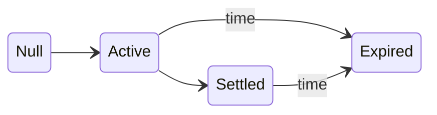

# Vault Statuses

A Bob vault can have one of three distinct statuses:

| Status    | Description                                                        |
| --------- | ------------------------------------------------------------------ |
| `ACTIVE`  | Tokens can be deposited into the vault.                            |
| `SETTLED` | The target price has been reached and tokens can be withdrawn.     |
| `EXPIRED` | The expiry timestamp has been reached and tokens can be withdrawn. |

The vault status is computed on-the-fly as the following:

```math
\text{status} =
\begin{cases}
\text{EXPIRED} & \text{if } \text{block.timestamp} \geq \text{expiry} \\
\text{SETTLED} & \text{if } \text{lastSyncedPrice} \geq \text{targetPrice} \\
\text{ACTIVE} & \text{otherwise}
\end{cases}
```

:::info

- Expiry takes precedence over settlement. If the expiry has passed, the vault is always `EXPIRED` regardless of the
  last synced price.
- A vault does not become `SETTLED` automatically when the target price is reached. An on-chain transaction must be
  triggered manually — either by calling `redeem` or `syncPriceFromOracle` — to update the last synced price and
  transition the vault to `SETTLED`.

:::

## State Transitions



## Q&A

### Q: What is a null vault?

A: A vault that does not exist. Trying to interact with a null vault will always revert.

### Q: Can a vault be canceled or modified after creation?

A: No. Vault parameters are immutable once set.

### Q: Market price of the token is already over the target price, but the vault is still in the active state. What should I do?

A: You can call `redeem` which will automatically use the latest price from the vault oracle and change the vault
status. Alternatively, you can also call `syncPriceFromOracle` to update the latest price in the vault and change its
status.
