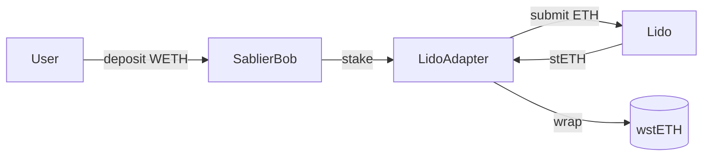
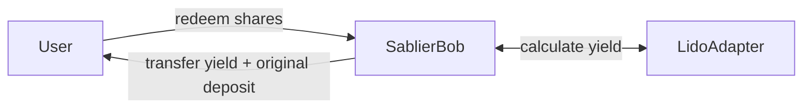

# Lido Adapter

Lido adapter is a smart contract that is used to generate yield on the locked tokens in a vault.

Only the vaults with the following tokens on Ethereum mainnet can generate yield using Lido adapter:

- ETH
- WETH

:::info

Once a vault is created, the adapter cannot be changed. Any change to the adapter only impacts the new vaults.

:::

## Deposit Flow

When a user deposits into such vaults, the adapter transfers the tokens into Lido protocol to earn yield. The adapter
then tracks the yield generated per user.



When a user deposits WETH, adapter transfers it to the Lido protocol and receives stETH in return. It then wraps the
stETH into wstETH which is stored on the adapter contract address. The wstETH token represents the principal amount as
well as the yield generated from Lido.

## Redeem Flow

When a vault settles or expires, users can redeem their shares for the underlying tokens. The adapter will then
calculate the user's proportional share of the yield generated from Lido and transfer it to the user along with the
original deposit amount.



During the first redemption, the adapter converts wstETH back into WETH and transfers them to the Bob contract. There
are two pathways implemented to in the adapter to convert wstETH back into WETH:

### Curve Swap (Default)

The default path follows wstETH → stETH → ETH via the
[Curve stETH/ETH pool](https://curve.fi/dex/ethereum/pools/steth/deposit/), then wraps to WETH. This path:

- Is immediate.
- Uses Chainlink's stETH/ETH oracle for slippage protection.
- Has a tight slippage tolerance.

### Lido Withdrawal Queue

In case the Curve exchange fails due to low liquidity, the Comptroller can request a withdrawal using the Lido
withdrawal queue. This path:

- Is slower due to the waiting period of the Lido withdrawal queue.
- Has no slippage.
- Takes precedence over the Curve path once initiated.

## Yield Tracking

The adapter tracks each user's balance using the following formula:

```math
\text{user WETH share} = \frac{\text{user wstETH}}{\text{vault total wstETH}} \times \text{total WETH from unstaking}
```

When the yield is positive, a [fee](/concepts/fees#bob-vaults) is applied to it. For example, if a user deposits 1 WETH
and receives 1.05 WETH after redemption, the yield is 0.05 WETH. If the vault yield fee is 10%, the fee is 0.005 WETH.
The user will receive 1.045 WETH.

## Vaults Without Adapters

Vaults created for tokens without any adapter hold the deposited tokens directly in the
[`SablierBob`](/reference/bob/contracts/contract.SablierBob) contract. In this case, a flat fee in the chain's native
token is charged at redemption.
