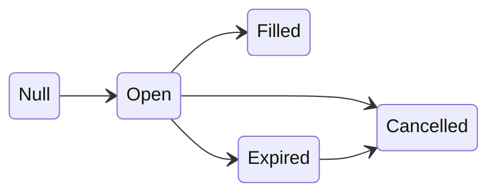

# Order Statuses

An Escrow order can have one of four distinct statuses:

| Status      | Description        |
| ----------- | ------------------ |
| `OPEN`      | An open order.     |
| `FILLED`    | A filled order.    |
| `CANCELLED` | A cancelled order. |
| `EXPIRED`   | An expired order.  |

The status is computed at runtime as the following:

1. If `wasFilled` is true → **FILLED**
2. Else if `wasCanceled` is true → **CANCELLED**
3. Else if `expiryTime ≠ 0` and `block.timestamp ≥ expiryTime` → **EXPIRED**
4. Else → **OPEN**

## State Transitions

## Private vs Open Orders

When `buyer ≠ address(0)`, the order is considered private, that means only the buyer specified in the order can fill
it. When `buyer = address(0)`, anyone can fill the order.

## Q&A

### Q: What is a null order?

A: An ID that does not reference a created order. Trying to interact with a null order will always revert.

### Q: Can the seller update an order's price or expiry?

A: No. Order parameters are immutable. To change terms, cancel the existing order and create a new one.

### Q: Can a buyer partially fill an order?

A: No. Orders are all-or-nothing.
