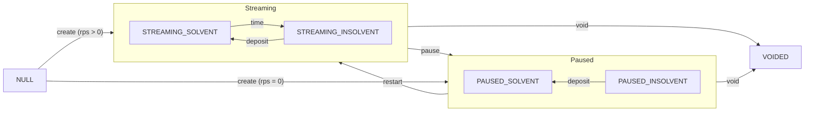

# Stream Statuses

A Flow stream can have one of five distinct statuses:

| Status                | Description                                                                         |
| --------------------- | ----------------------------------------------------------------------------------- |
| `STREAMING_SOLVENT`   | Active stream with total debt <ins>not exceeding</ins> stream balance.              |
| `STREAMING_INSOLVENT` | Active stream with total debt <ins>exceeding</ins> stream balance.                  |
| `PAUSED_SOLVENT`      | Paused stream with total debt <ins>not exceeding</ins> stream balance.              |
| `PAUSED_INSOLVENT`    | Paused stream with total debt <ins>exceeding</ins> stream balance.                  |
| `VOIDED`              | Paused stream that can no longer be restarted and has forfeited its uncovered debt. |

## Stream characteristics

A stream can have the following characteristics:

| Characteristic | Statuses                                        | Description                                             |
| :------------- | :---------------------------------------------- | :------------------------------------------------------ |
| Streaming      | `STREAMING_SOLVENT`, `STREAMING_INSOLVENT`      | Non-zero rps.                                           |
| Paused         | `PAUSED_SOLVENT`, `PAUSED_INSOLVENT`, `VOIDED`  | Zero rps.                                               |
| Solvent        | `STREAMING_SOLVENT`, `PAUSED_SOLVENT`, `VOIDED` | Total debt <ins>not exceeding</ins> the stream balance. |
| Insolvent      | `STREAMING_INSOLVENT`, `PAUSED_INSOLVENT`       | Total debt <ins>exceeding</ins> the stream balance.     |

## Diagram

The following diagram illustrates the statuses and the allowed transitions between them:

## Q&A

### Q: What is a null stream?

A: An ID that does not reference a created stream. Trying to interact with a null stream will result in a revert.

### Q: What to do with a stream status?

A: Knowing the status of a stream can inform your decision making. For example, if a stream is `STREAMING_INSOLVENT`,
that means the stream is active but has insufficient balance. As a sender, you should deposit into the stream so that
your recipient can withdraw the streamed amount without any hiccups. And if you don't want to continue the stream, you
can pause it.

### Q: Who can make a stream `VOIDED`?

A: Both sender and recipient can void the stream. This is especially useful when either party wants to stop the stream
immediately. Once a stream is voided, it cannot be restarted. If there is uncovered debt, it will be reset to 0. So to
ensure that your recipient does not lose on any streamed amount, you can deposit into the stream before voiding it.
