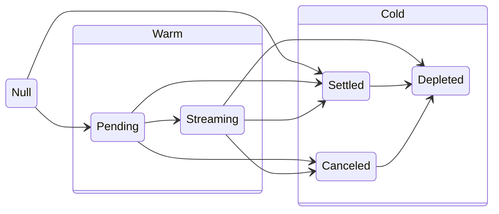

# Stream Statuses

A Lockup stream can have one of five distinct statuses:

| Status      | Description                                                       |
| ----------- | ----------------------------------------------------------------- |
| `PENDING`   | Stream created but not started; tokens are in a pending state.    |
| `STREAMING` | Active stream where tokens are currently being streamed.          |
| `SETTLED`   | All tokens have been streamed; recipient is due to withdraw them. |
| `CANCELED`  | Canceled stream; remaining tokens await recipient's withdrawal.   |
| `DEPLETED`  | Depleted stream; all tokens have been withdrawn and/or refunded.  |

## Temperature

A stream status can have one out of two "temperatures":

| Temperature | Statuses                    | Description                                                                                    |
| :---------- | :-------------------------- | :--------------------------------------------------------------------------------------------- |
| Warm        | Pending, Streaming          | The passage of time alone <ins>can</ins> change the status.                                    |
| Cold        | Settled, Canceled, Depleted | The passage of time alone <ins>cannot</ins> change the status. Only a user action can do this. |

## State transitions

The following diagram illustrates the statuses and the allowed transitions between them:

## Q&A

### Q: What is a null stream?

A: An id that does not reference a created stream. Trying to interact with a null stream will result in a revert.

### Q: What to do with a stream status?

A: Knowing the status of a stream can inform your decision making. For example, if a stream is canceled, you know that
you can't cancel it again. Or, if a stream is depleted, you know that you can't withdraw any more tokens from it.

### Q: How can a stream enter the `SETTLED` status directly?

A: This is a peculiarity of the [Lockup Dynamic](/concepts/lockup/stream-shapes#lockup-dynamic) streams. Segment amounts
can be zero, and the segment milestones can be set in such a way that all non-zero segments are in the past. This will
cause the stream to enter the `SETTLED` status directly.
