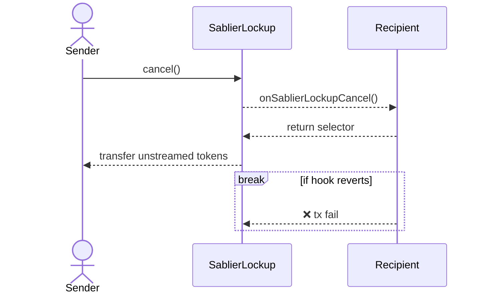
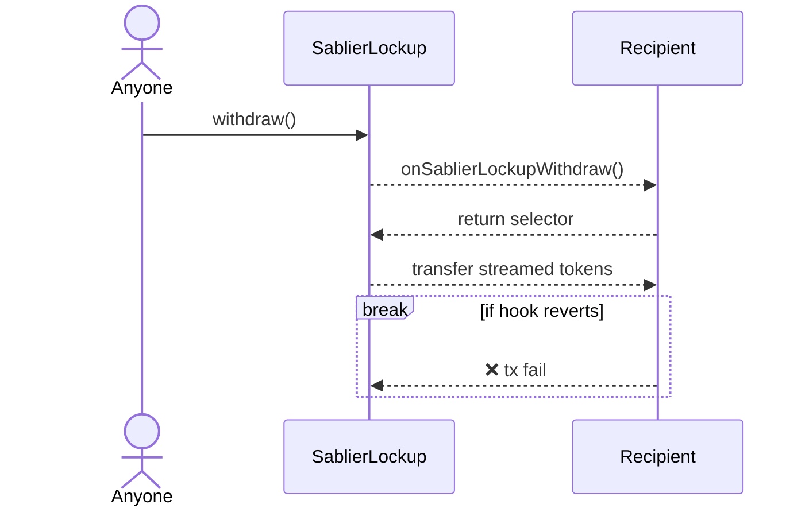

Hooks are arbitrary third-party functions that get automatically executed by the Sablier Protocol in response to
`cancel` and `withdraw` events. They are similar to callback functions in web2.

:::info Important

Hooks have to be allowlisted before they can be run. Currently, only the [Protocol Admin](/concepts/governance) has
permission to do this. In the future, we may decentralize this process through governance.

:::

Hooks are a powerful feature that enable Sablier streams to interact with other DeFi protocols. Let's consider an
example:

You own a Sablier stream that expires in two years. You are interested into taking a loan against it with the intention
to pay it all back after it expires. Hooks are what enable you to do that. With the help of Hooks, we can create an
ecosystem of varied use cases for Sablier streams. This can range from lending, staking, credit, and more.

It is worth noting that once a hook has been allowlisted, it can never be removed. This is to ensure stronger
immutability and decentralization guarantees. Once a recipient contract is allowlisted, integrators do NOT have to trust
us to keep their contract on the allowlist.

## Checklist

The requirements a hook contract must meet:

1. The contract is not upgradeable.
2. The contract was audited by a third-party security researcher.
3. The contract implements `supportsInterface` and returns `true` for `0xf8ee98d3`, i.e.,
   `type(ISablierLockupRecipient).interfaceId`.
4. If it implements `onSablierLockupCancel`:
   1. It returns `ISablierLockupRecipient.onSablierLockupCancel.selector`.
   1. It reverts if `msg.sender` is not the Lockup contract.
   1. It uses input parameters correctly: `streamId`, `sender`, `senderAmount`, `recipientAmount`.
   1. Be aware that if the call reverts, the entire `cancel` execution would revert too.
5. If it implements `onSablierLockupWithdraw`:
   1. It returns `ISablierLockupRecipient.onSablierLockupWithdraw.selector`.
   1. It reverts if `msg.sender` is not Lockup contract.
   1. It uses input parameters correctly: `streamId`, `caller`, `to`, `amount`.
   1. Be aware that if the call reverts, the entire `withdraw` execution would revert too.

## Visual representation

:::note

If the recipient contract is not on the Sablier allowlist, the hooks will not be executed.

:::

### Cancel hook

### Withdraw hook

## Next steps

If you are interested into using Sablier hooks into your protocol, please check the
[Hook guide](/guides/lockup/examples/hooks). If you are looking to get on the allowlist, reach out to us on
[Discord](https://discord.sablier.com).
