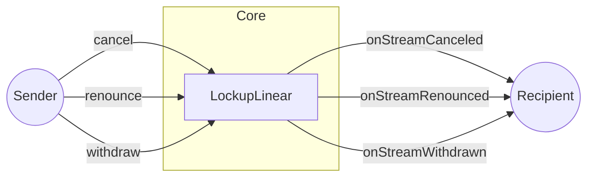

In Sablier, hooks are arbitrary functions that get automatically executed by the protocol in response to specific
events. Their purpose is to programmatically notify the recipient when the sender interacts with a stream.

Hooks can only be written in smart contracts, so typical EOAs cannot implement them. However, they are entirely
optional. You can interact with the Sablier Protocol without implementing any hooks.

:::info

Hooks in smart contracts are similar to callback functions in web2.

:::

## Visual representation

### Sender actions

If the recipient is not a smart contract, the hooks will not be run.

## Example scenario

Suppose you have created an NFT lending marketplace and wish to integrate Sablier. As a first step, you would typically
ask your users to deposit their Sablier NFTs into your contracts, so that they can be used as collateral.

In such a scenario, you are naturally interested to know what's happening to the stream. For instance, you might want to
know whether the stream has been canceled or if funds have been withdrawn from it. Hooks enable your protocol to
programmatically react to these events.

## Next steps

Looking to incorporate a hook in your Sablier integration? Check out this [guide](/contracts/v2/guides/hooks).
