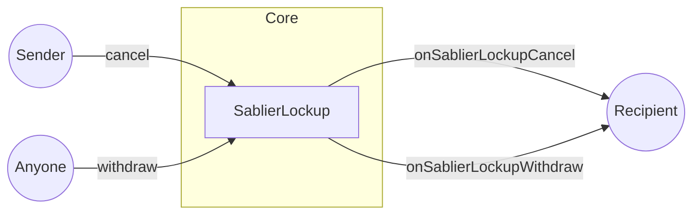

In Sablier, hooks are arbitrary functions that get automatically executed by the protocol in response to `cancel` and
`withdraw` events.

Hooks in smart contracts are similar to callback functions in web2.

Hooks are powerful feature that enable Sablier streams to interact with other DeFi protocols. Let's consider an example.
You own a Sablier stream that expires in 2 years. You are interested into taking a loan against it with the intention to
pay it all back after it expires. Hooks are what enable you to do that. With the help of Hooks, we can create an
ecosystem of varied use cases for Sablier streams. This can range from lending, staking, credit and many more.

Currently, in order to hook to the Sablier Protocol, external DeFi protocols must be added to the allowlist by the
protocol admin. In the future, we aim to decentralize it through governance.

:::info

[`allowToHook`](/contracts/v2/reference/core/interfaces/interface.ISablierV2Lockup#allowtohook) is an irreversible
operation, i.e., once a contract has been added to the allowlist, it can never be removed. This is to ensure stronger
immutability and decentralization guarantees. Once a recipient contract is allowlisted, integrators should NOT have to
trust us to keep their contract on the allowlist.

:::

Hooks are entirely optional. They are only executed if the recipient of the Sablier stream is one of the contracts from
the allowlist.

## Visual representation

:::note

If the recipient contract is not on the allowlist, the hooks will not be executed.

:::

## Next steps

Looking to get on the allowlist? Reach out to us on [Discord](https://discord.gg/bSwRCwWRsT).
