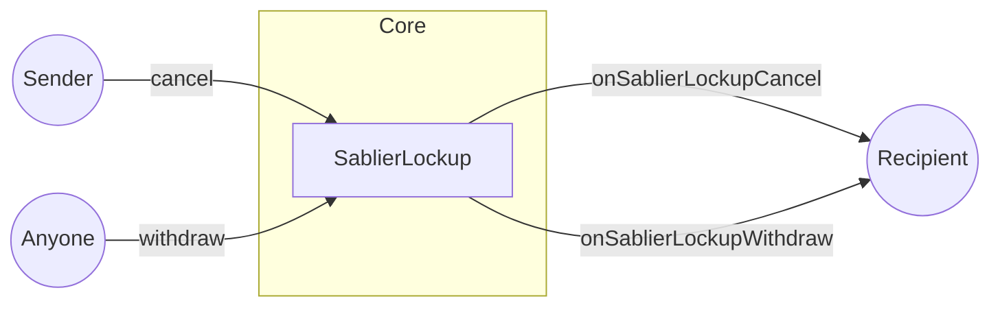

Hooks are arbitrary functions that get automatically executed by Sablier in response to `cancel` and `withdraw` events.
They are similar to callback functions in web2.

:::info Important

Hooks have to be allowlisted before they can be run. Currently, only the [Protocol Admin](/concepts/governance) has
permission to do this. In the future, we aim to decentralize this process through governance.

:::

Hooks are powerful feature that enable Sablier streams to interact with other DeFi protocols. Let's consider an example.

You own a Sablier stream that expires in two years. You are interested into taking a loan against it with the intention
to pay it all back after it expires. Hooks are what enable you to do that. With the help of Hooks, we can create an
ecosystem of varied use cases for Sablier streams. This can range from lending, staking, credit, and more.

It is worth noting that once a hook has been allowlisted, it can never be removed. This is to ensure stronger
immutability and decentralization guarantees. Once a recipient contract is allowlisted, integrators do NOT have to trust
us to keep their contract on the allowlist.

## Visual representation

:::note

If the recipient contract is not on the allowlist, the hooks will not be executed.

:::

## Next steps

Looking to get on the allowlist? Reach out to us on [Discord](https://discord.gg/bSwRCwWRsT).
