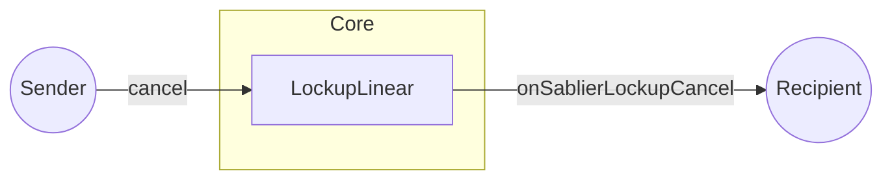
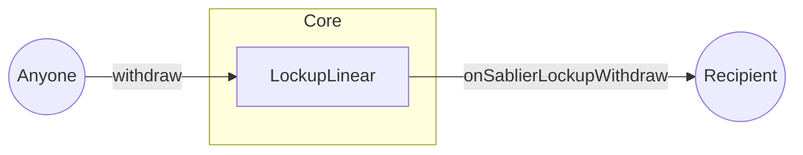

In Sablier, hooks are arbitrary functions that get automatically executed by the protocol in response to `cancel` and
`withdraw` events.

Hooks are powerful feature that enable Sablier streams to interact with other DeFi protocols. Let's consider an example.
You own a Sablier stream that expires in 2 years. You are interested into taking a loan against it with the intention to
pay it all back after it expires. Hooks are what enable you to do that. With the help of Hooks, we can create an
ecosystem of varied use cases for Sablier streams. This can range from lending, staking, credit and many more.

Currently, in order to hook to the Sablier Protocol, external DeFi protocols must be added to the `allowlist` which is
managed by the protocol admin. In the future, we aim to decentralize it through governance.

Hooks are entirely optional. They are only executed if the recipient of the Sablier stream is one of the contracts from
the `allowlist`.

:::info

Hooks in smart contracts are similar to callback functions in web2.

:::

## Visual representation

If the recipient contract is not on the allowlist, the hooks will not be executed.

## Next steps

Looking to get on the allowlist? Reach out to us on [Discord](https://discord.gg/bSwRCwWRsT).
