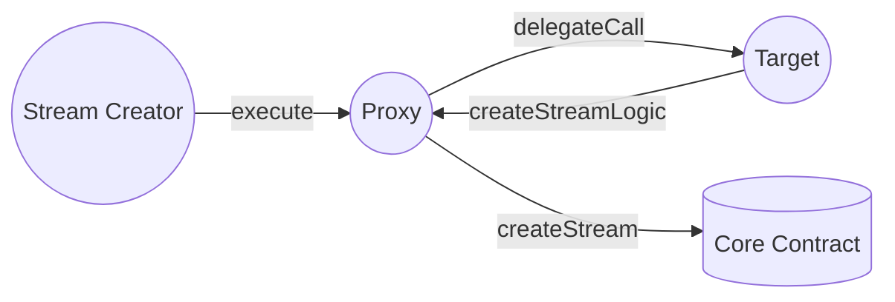

In Sablier V2, we are using a proxy architecture that is designed for the stream creators. A proxy contract allows
multiple calls within a single transaction. To gain a better understanding of how it works, refer to the prb-proxy
[documentation](https://github.com/PaulRBerg/prb-proxy/tree/0f68785ecf795d6aaf83c4e8ba5c0173139f1234).

:::caution

**Do not** confuse our approach with the use of an
[upgradable pattern](https://docs.openzeppelin.com/upgrades-plugins/1.x/proxies). Despite the similarity in name, these
are two different concepts.

:::

:::note

This guide assumes that you have already gone through [Access Control](/contracts/v2/reference/access-control),
[Proxy Target](/contracts/v2/reference/periphery/contract.SablierV2ProxyTarget) and
[Proxy Plugin](/contracts/v2/reference/periphery/contract.SablierV2ProxyPlugin) sections.

:::

A proxy contract can be thought of as an extension of the EOA. In the context of the core contracts, the sender that
will be stored is the address of the proxy itself.

While this architecture offers many benefits, we encountered a minor issue when a recipient cancels a stream. This issue
arises because the funds would be withdrawn to the proxy, and we need to automatically redirect them to the sender. To
address this, we introduced the [plugins](https://github.com/PaulRBerg/prb-proxy/wiki/Plugins).
