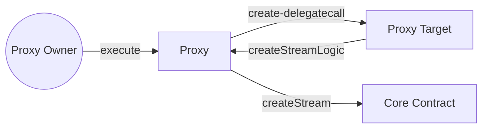

Sablier V2 uses a forwarding proxy architecture designed to make the protocol more modular and extensible without
introducing upgradeability. When using the Sablier Interface, senders are required to deploy a proxy before being able
to interact with the Sablier Protocol. However, deploying the proxy is a one-time event.

The particular forwarding proxy contract that we are using is [PRBProxy](https://github.com/PaulRBerg/prb-proxy).

You can think of a forwarding proxy as an extension of externally-owned accounts (
[EOAs](https://ethereum.org/en/developers/docs/accounts/#types-of-account) in short).

:::note

**Do not** confuse this approach with upgradable proxies. Despite having a similar name, these are two different
concepts. PRBProxy is not upgradeable.

:::

:::info

While reading the pages under this guide, it might helpful to keep the following docs in separate tabs:
[Access Control](/contracts/v2/reference/access-control),
[Proxy Target](/contracts/v2/reference/periphery/contract.SablierV2ProxyPlugin), and
[Technical Reference: Periphery](/contracts/v2/reference/overview#periphery).

:::

## Proxy is Sender

When creating streams via the proxy contract, two proxy will be recorded as the stream's sender:

## Permit2

In the [ProxyTarget][proxy-target], we use [Permit2](https://github.com/uniswap/permit2) for all interactions that
involve transfers of [ERC-20](https://ethereum.org/en/developers/docs/standards/tokens/erc-20/) tokens from the proxy
owner to the proxy contract. To be more specific, we are using the `AllowanceTransfer` contract instead of
`SignatureTransfer` because it offers a more user-friendly
[nonce schema](https://docs.uniswap.org/contracts/permit2/reference/allowance-transfer#nonce-schema).
