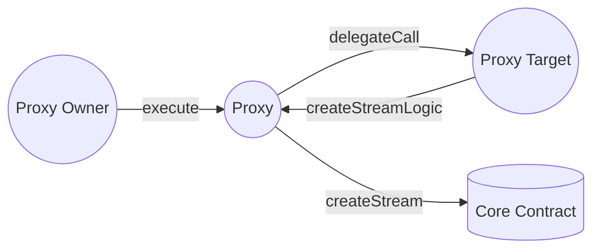

In Sablier V2, we are using a proxy architecture that is designed for the stream creators. A proxy contract allows
multiple calls within a single transaction. To gain a better understanding of how it works, refer to the prb-proxy
[documentation](https://github.com/PaulRBerg/prb-proxy/tree/0f68785ecf795d6aaf83c4e8ba5c0173139f1234).

:::caution

**Do not** confuse our approach with the use of an
[upgradable pattern](https://docs.openzeppelin.com/upgrades-plugins/1.x/proxies). Despite sharing the same name, these
are two different concepts.

:::

:::note

This guide assumes that you have already gone through [Access Control](/contracts/v2/reference/access-control),
[Proxy Target](/contracts/v2/reference/periphery/contract.SablierV2ProxyTarget) and
[Proxy Plugin](/contracts/v2/reference/periphery/contract.SablierV2ProxyPlugin) sections.

:::

You can view a proxy contract as an extension of the Externally-owned account
([EOA](https://ethereum.org/en/developers/docs/accounts/#types-of-account)). When it comes to the core contracts, the
sender, which will be stored, will be the address of the proxy itself.

In the Proxy Target, we use [Permit2](https://github.com/uniswap/permit2#permit2) for all interactions involving
[ERC-20](https://ethereum.org/en/developers/docs/standards/tokens/erc-20/) tokens being transferred from the Proxy owner
to the Proxy contract. To be more specific, we are using the `AllowanceTransfer` contract over the `SignatureTransfer`
because it offers a more user-friendly
[nonce schema](https://docs.uniswap.org/contracts/permit2/reference/allowance-transfer#nonce-schema).

While this architecture offers many benefits, we encountered a minor issue when a recipient cancels a stream. This issue
arises because the funds would be withdrawn to the proxy, and we need to automatically redirect them to the sender. To
address this, we introduced the [plugins](https://github.com/PaulRBerg/prb-proxy/wiki/Plugins).
