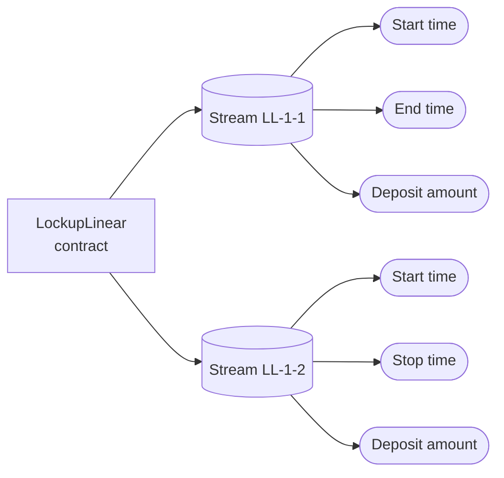
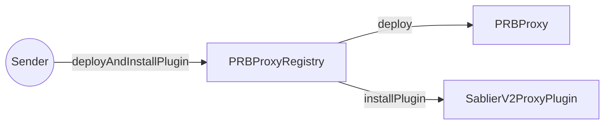
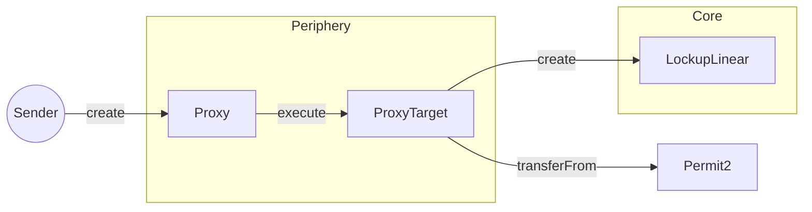
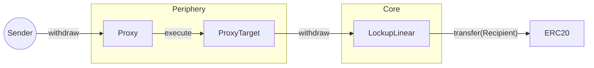
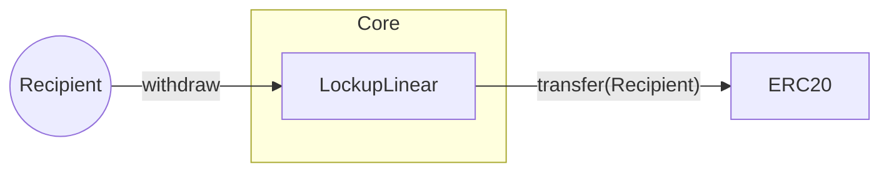
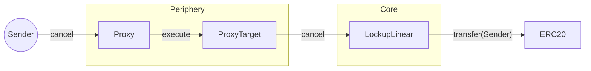
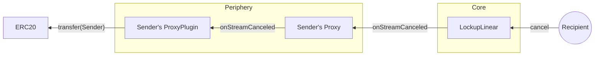

## Storage layout

Each Lockup contract is a singleton that stores all streams created by all users. The following diagrams will give you
an idea of how the storage layout looks like.

### Lockup Linear

### Lockup Dynamic

An example of two streams being stored in the Lockup Dynamic contract.

## Scenarios

A collection of scenarios to help you understand how the Sablier Protocol works from end to end.

:::note

In the diagrams below, LockupLinear is used as an example. LockupDynamic could be used in its place and the diagrams
would still be valid.

"ERC20" can be any ERC20-compliant token.

:::

## Set up proxy

This is the first action that the sender needs to take in order to create a stream via the Sablier Interface. It is a
one-time action that deploy a [PRBProxy](https://github.com/PaulRBerg/prb-proxy) contract for senders.

## Create a stream

### Withdraw from a stream

### Sender withdraws

### Recipient withdraws

## Cancel a stream

### Sender cancels

### Recipient cancels

When the recipient cancels a stream, the sender is automatically refunded the remaining balance.

If the sender create the stream via a proxy, the proxy plugin will be notified of the cancellation and will auto-forward
the refund to the sender.

