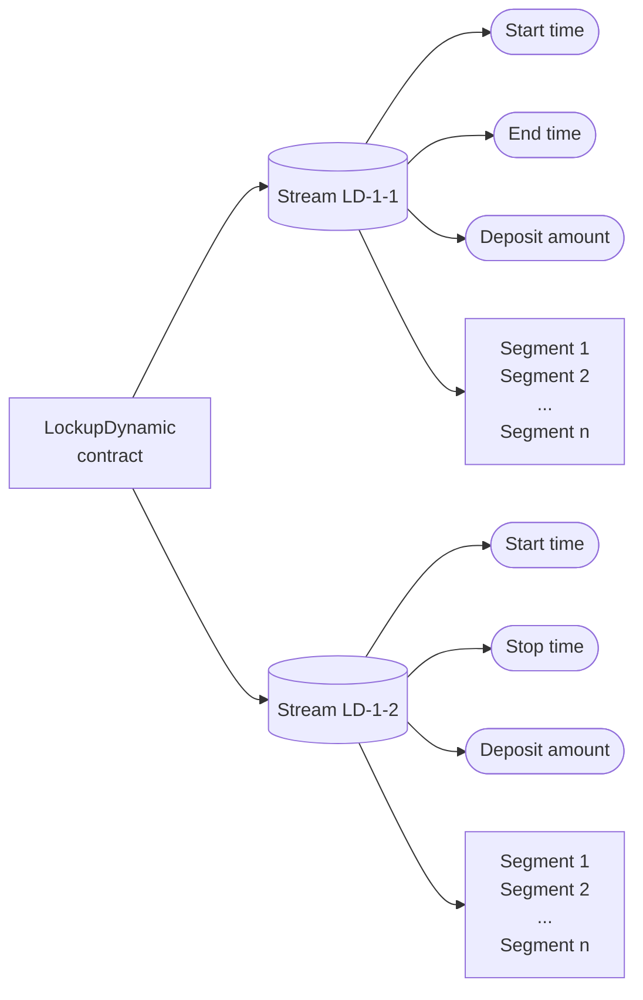
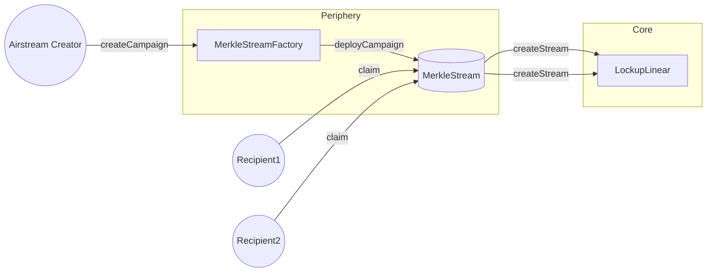

## Storage layout

Each Lockup contract is a singleton that stores all streams created by all users. The following diagrams will give you
an idea of how the storage layout looks like.

:::note

In the diagrams below, we will show only some of the storage properties. The full list for `LockupLinear` can be found
[here](/contracts/v2/reference/core/types/library.LockupLinear#stream), and for `LockupDynamic`
[here](/contracts/v2/reference/core/types/library.LockupDynamic#stream).

:::

### Lockup Linear

### Lockup Dynamic

An example of two streams being stored in the Lockup Dynamic contract.

### Airstream Campaign

An example of a user creating an Airstream campaign.

