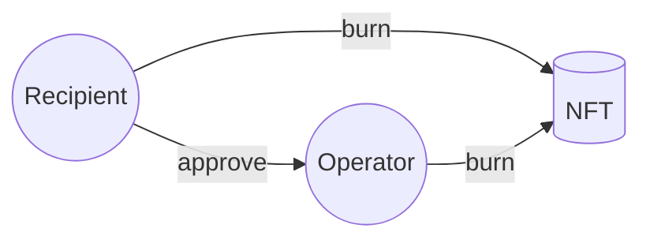
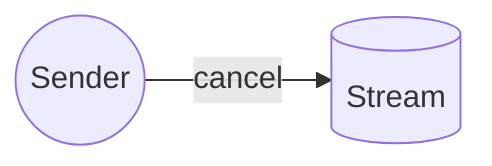
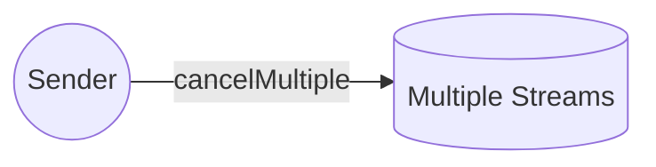
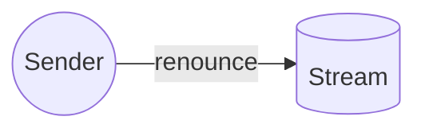
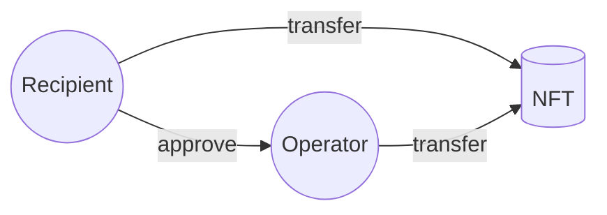
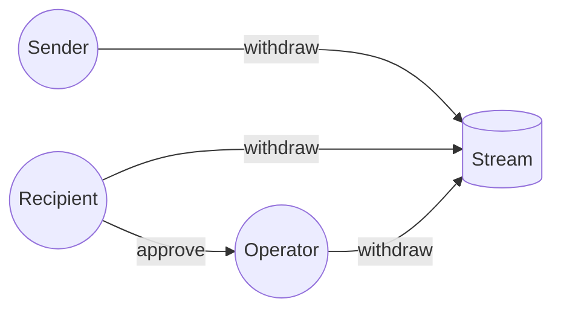
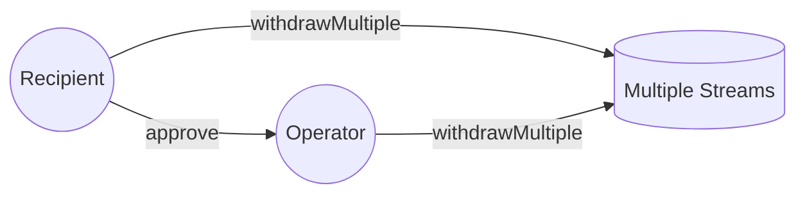

With the exception of the [admin functions](/docs/concepts/05-governance.md), all functionality in Sablier is related to
one or more streams.

This article will provide a comprehensive overview of the actions that can be performed on streams once they are
created, as well as the corresponding user permissions for each action.

:::note

Every stream has a sender, a recipient, and possibly multiple NFT operators, with the recipient being the owner of the
NFT.

:::

## Overview

The table below offers a quick overview of the access control for each action that can be performed on a stream.

| Action            | Sender | Recipient | Operator(s) |
| ----------------- | :----: | :-------: | :---------: |
| Burn NFT          |   ❌   |    ✅     |     ✅      |
| Cancel            |   ✅   |    ❌     |     ❌      |
| Cancel Multiple   |   ✅   |    ❌     |     ❌      |
| Renounce          |   ✅   |    ❌     |     ❌      |
| Transfer NFT      |   ❌   |    ✅     |     ✅      |
| Withdraw          |   ✅   |    ✅     |     ✅      |
| Withdraw Multiple |   ✅   |    ✅     |     ✅      |

## Burn NFT

Either the recipient or an approved operator can burn the NFT associated with a stream.

## Cancel

Only the sender can cancel a stream.

## Cancel Multiple

Only the sender can cancel multiple streams.

## Renounce

Only the sender can renounce a stream.

## Transfer NFT

Either the recipient or an approved operator can transfer the NFT associated with a stream.

- Only if the stream is transferable.

## Withdraw

The assets in a stream can be withdrawn by the sender, recipient, or an approved NFT operator.

- Both the recipient and the NFT operator have the option to specify a custom address to withdraw the assets to.
- The sender, however, is limited to withdrawing assets directly to the recipient's address.

## Withdraw Multiple

Either the recipient or an approved NFT operator can withdraw assets from multiple streams.

- The caller has the option to specify a custom address to withdraw the assets to.
- The caller must be either the recipient or an approved NFT operator of each stream.

