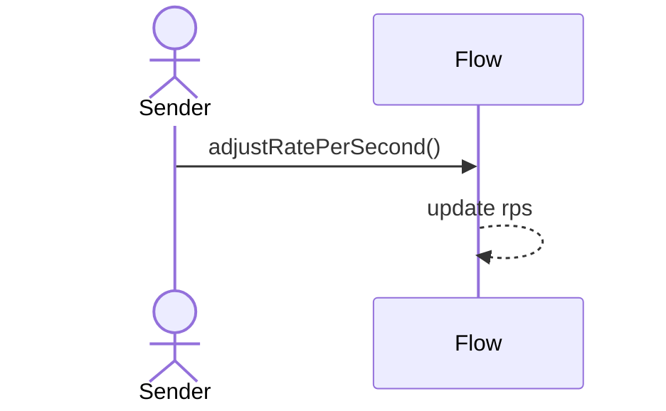
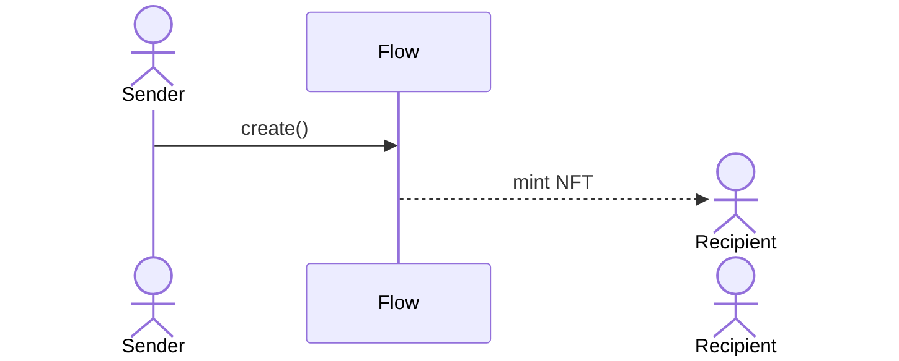
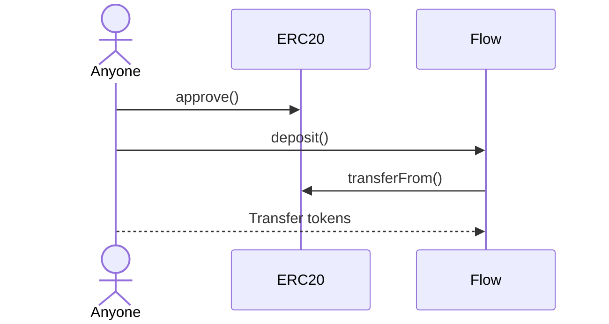
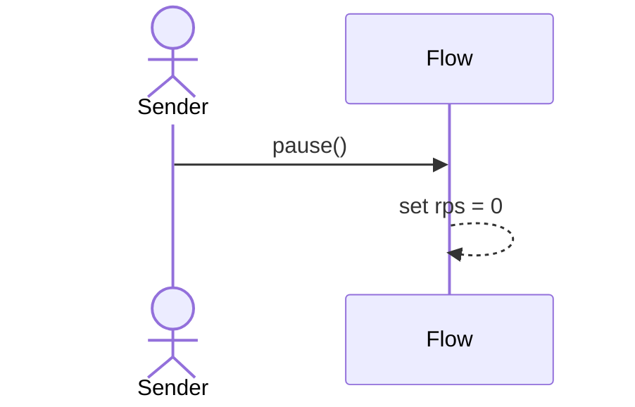
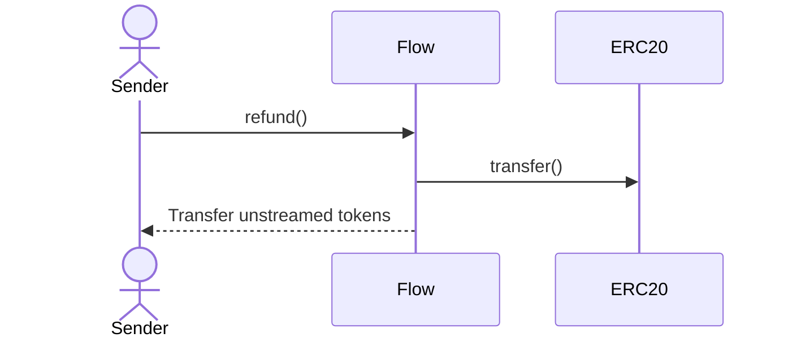
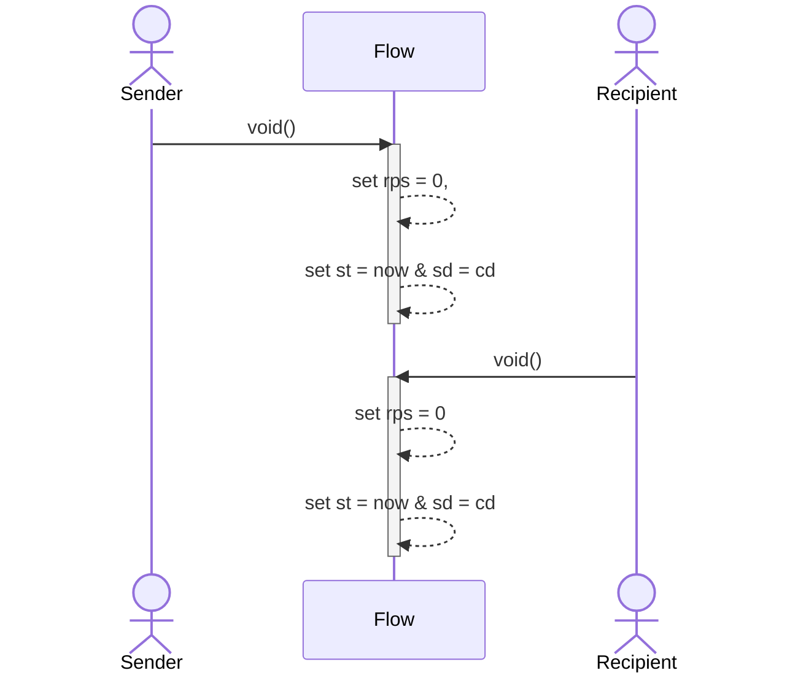
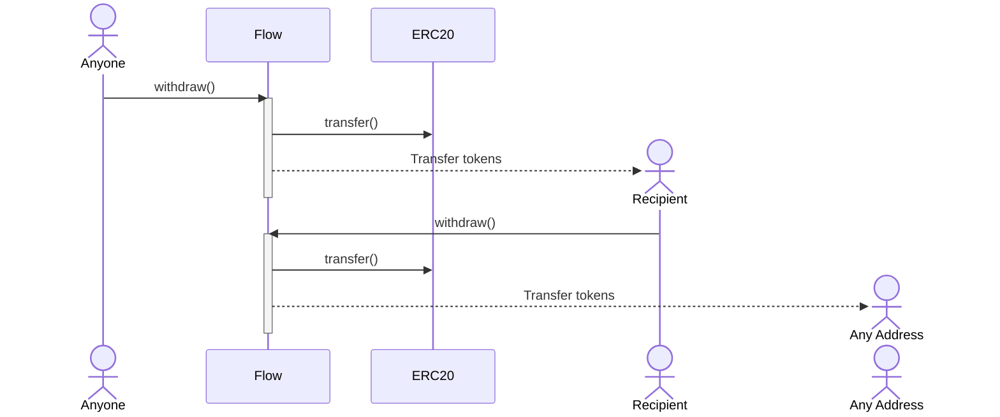

With the exception of the [admin functions](/concepts/governance#flow), all functions in Flow can only be triggered by
users. The Protocol Admin has no control over any stream or any part of the protocol.

This article will provide a comprehensive overview of the actions that can be performed on streams once they are
created, as well as the corresponding user permissions for each action.

:::note

Every stream has a sender and a recipient. Recipients can approve third parties to take actions on their behalf. An
'public' caller is any address outside of sender and recipient.

:::

## Overview

The table below offers a quick overview of the access control for each action that can be performed on a stream.

| Action                  | Sender | Recipient / Approved third party | Public |
| ----------------------- | :----: | :------------------------------: | :----: |
| AdjustRatePerSecond     |   ✅   |                ❌                |   ❌   |
| Deposit                 |   ✅   |                ✅                |   ✅   |
| Pause                   |   ✅   |                ❌                |   ❌   |
| Refund                  |   ✅   |                ❌                |   ❌   |
| Restart                 |   ✅   |                ❌                |   ❌   |
| Transfer NFT            |   ❌   |                ✅                |   ❌   |
| Withdraw to any address |   ❌   |                ✅                |   ❌   |
| Withdraw to recipient   |   ✅   |                ✅                |   ✅   |
| Void                    |   ✅   |                ✅                |   ❌   |

## Adjust rate per second

Only the sender can adjust the rate per second of a stream.

## Create stream

## Deposit into a stream

Anyone can deposit into a stream.

## Pause

Only the sender can pause a stream.

## Refund from a stream

Only the sender can refund from a stream.

## Restarting a stream

Only the sender can restart a stream.

## Voiding a stream

Both Sender and Recipient can void a stream.

## Withdraw from a stream

Anyone can call withdraw on a stream as long as `to` address matches the recipient. If recipient/operator is calling
withdraw on a stream, they can choose to withdraw to any address.

