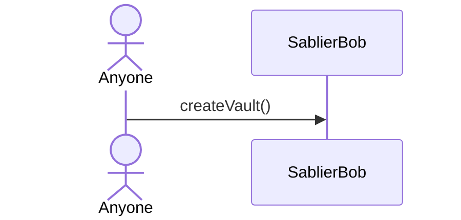
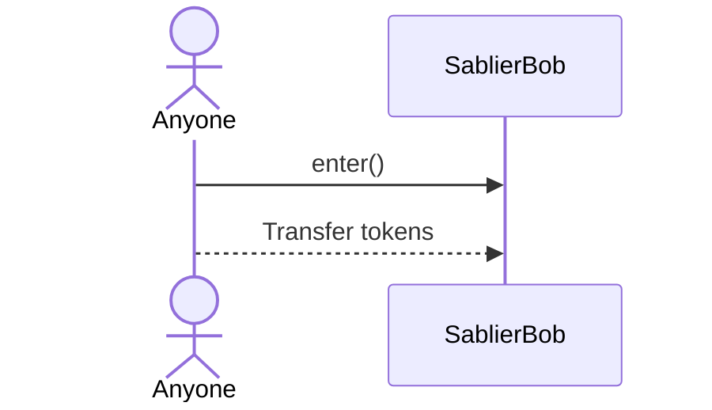
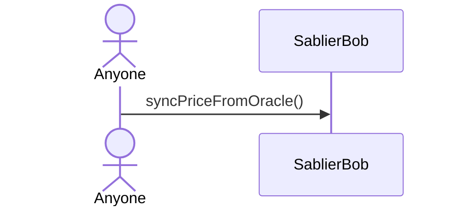
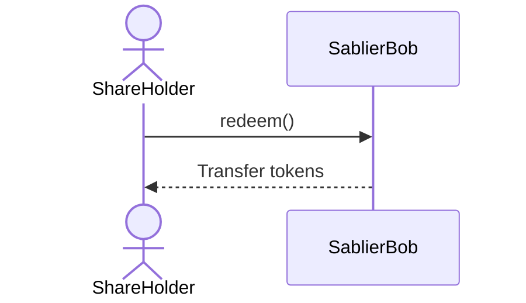

With the exception of the [admin functions](/concepts/governance#bob), all functions in Bob can be triggered by users.
The Comptroller has no control over any vault or deposited tokens.

| Action              | Anyone | Share Holder | Comptroller |
| ------------------- | :----: | :----------: | :---------: |
| Create Vault        |   ✅   |      ✅      |     ✅      |
| Enter               |   ✅   |      ✅      |     ✅      |
| Enter with Native   |   ✅   |      ✅      |     ✅      |
| Sync Price          |   ✅   |      ✅      |     ✅      |
| Unstake via Adapter |   ✅   |      ✅      |     ✅      |
| Redeem              |   ❌   |      ✅      |     ❌      |
| Transfer Shares     |   ❌   |      ✅      |     ❌      |
| Set Default Adapter |   ❌   |      ❌      |     ✅      |
| Set Native Token    |   ❌   |      ❌      |     ✅      |

## Create Vault

Anyone can create a vault.

## Enter

Anyone can deposit tokens into an active vault.

## Sync Price

Anyone can trigger a price sync on any active vault.

## Redeem

Only a share holder can redeem from a settled or expired vault.

