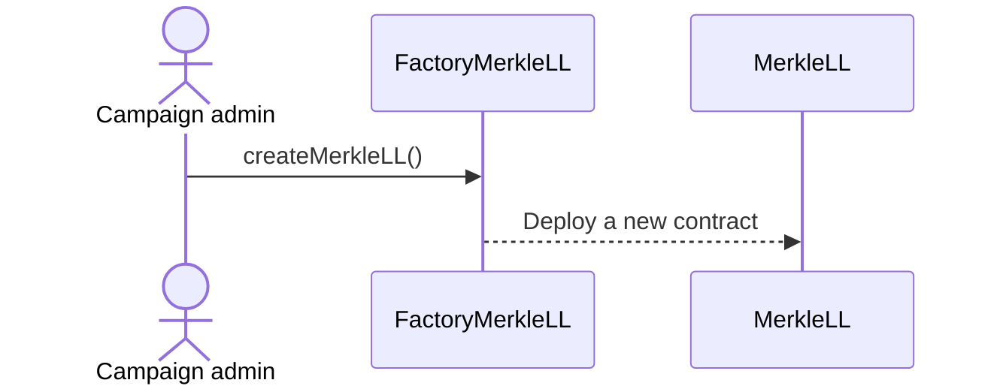
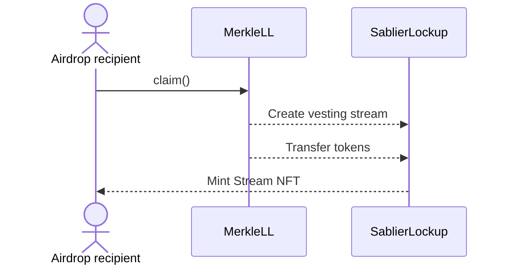
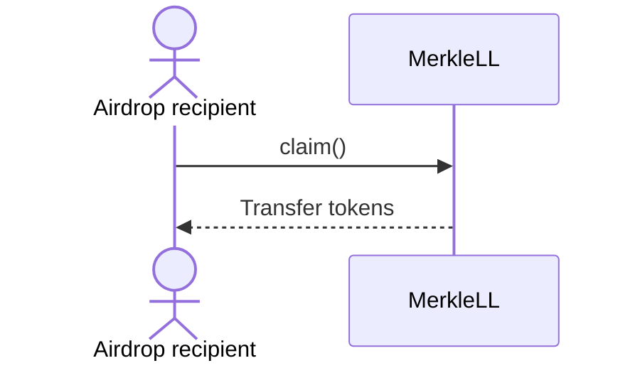
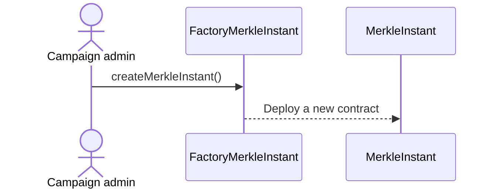
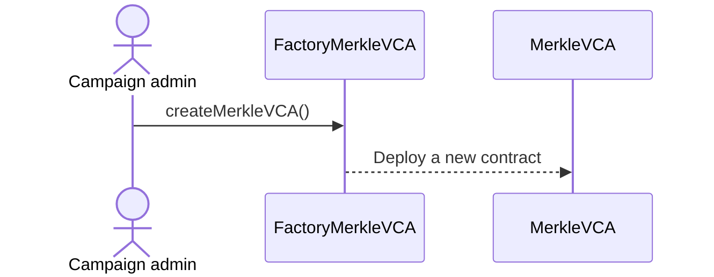
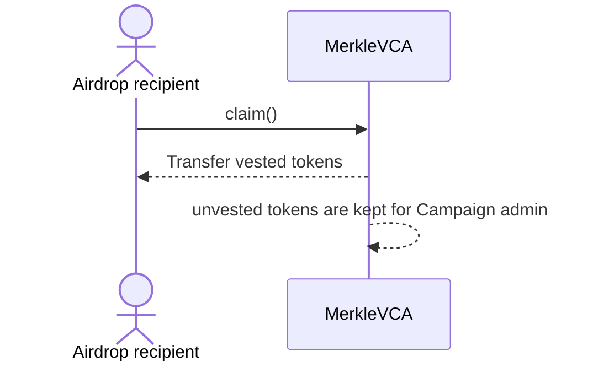
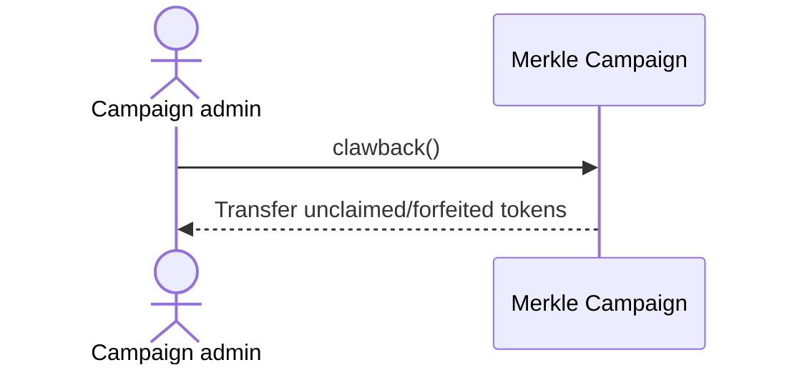

## Airstream Campaigns

In an airstream campaign, there is a vesting of tokens which is powered by Sablier Lockup protocol. A typical airstream
campaign creation flow looks like the following:

And this is how the claim flow looks like for recipients:

If recipient claims after the vesting end date, then no stream is created and the full allocation is transferred
directly to the recipient's wallet.

## Instant Airdrop Campaigns

In an instant airdrop campaign, there is no vesting and airdropped tokens are claimed directly to the users' wallets. A
typical instant airdrop campaign creation flow looks like the following:

And this is how the claim flow looks like for recipients:

## Variable Claim Airdrop Campaigns

In a variable claim airdrop campaign, there is a vesting of tokens similar to Airstream campaigns, however, user only
receives an amount of token depending on the time elapsed since the start of the campaign. The forfeited amount of
tokens is returned back the project.

And this is how a typical claim flow looks like for recipients: Transfer

## Clawback

For campaign admins, we offer `clawback` functionality which can be used to retrieve unclaimed funds after expiration.
In case of variable claim campaign, `clawback` can be used to retrieve forfeited tokens.

There is also a grace period that ends 7 days after the first claim is made. During the grace period, admin can
`clawback` to return funds from the campaign contract. This is useful in case there had been an accidental transfer of
funds.

