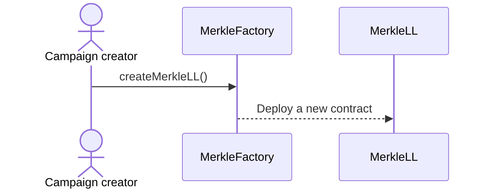
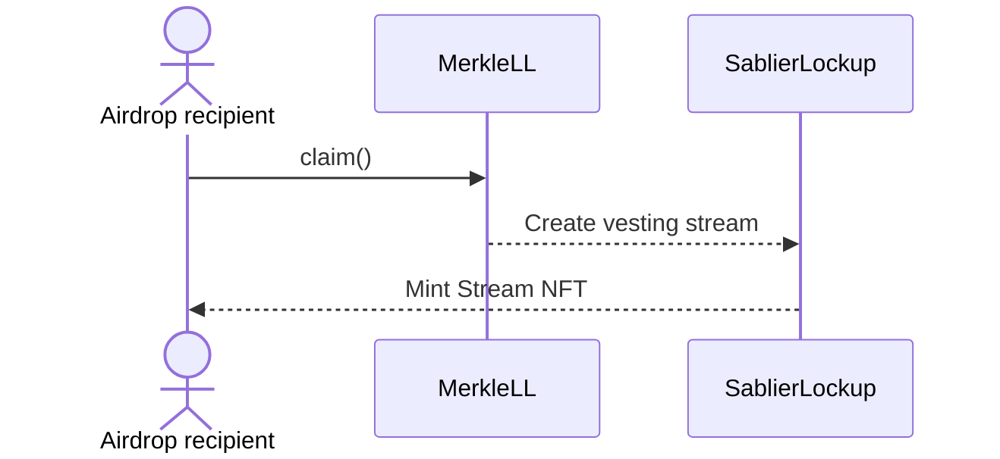
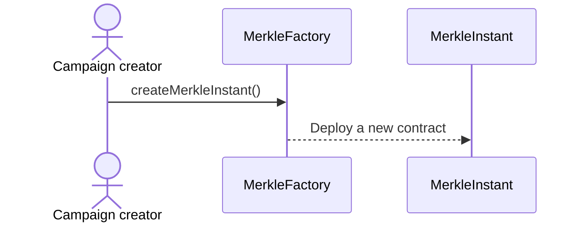
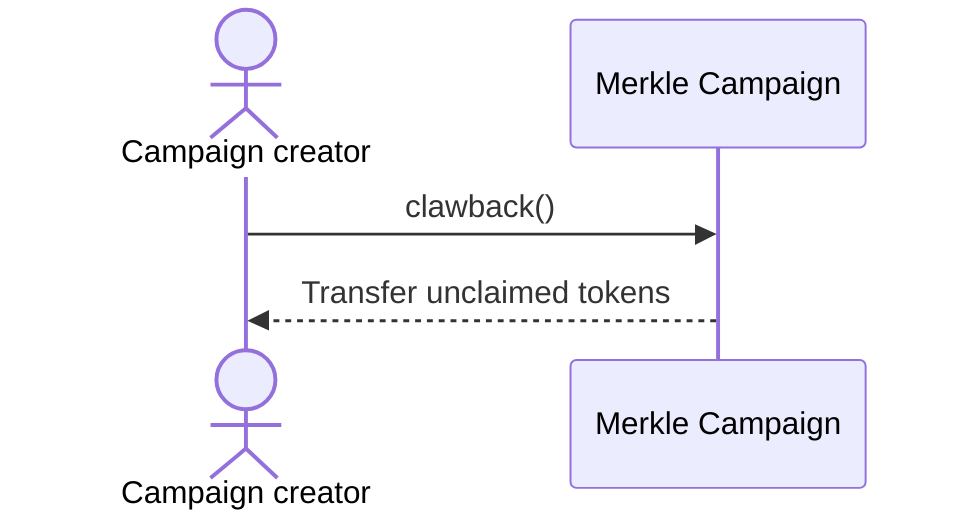

## Airstream Campaigns

In an airstream campaign, there is a vesting of tokens which is powered by Sablier Lockup protocol. A typical airstream
campaign creation flow looks like the following:

And this is how the claim flow looks like for recipients:

## Instant Airdrop Campaigns

In an instant airdrop campaign, there is no vesting and airdropped tokens are claimed directly to the users' wallets. A
typical instant airdrop campaign creation flow looks like the following:

And this is how the claim flow looks like for recipients:

## Clawback

For campaign admins, we offer `clawback` functionality which can be used to retrieve unclaimed funds after expiration.
There is also a grace period that ends 7 days after the first claim is made. During the grace period, admin can
`clawback` to return funds from the campaign contract. This is useful in case there had been an accidental transfer of
funds.

