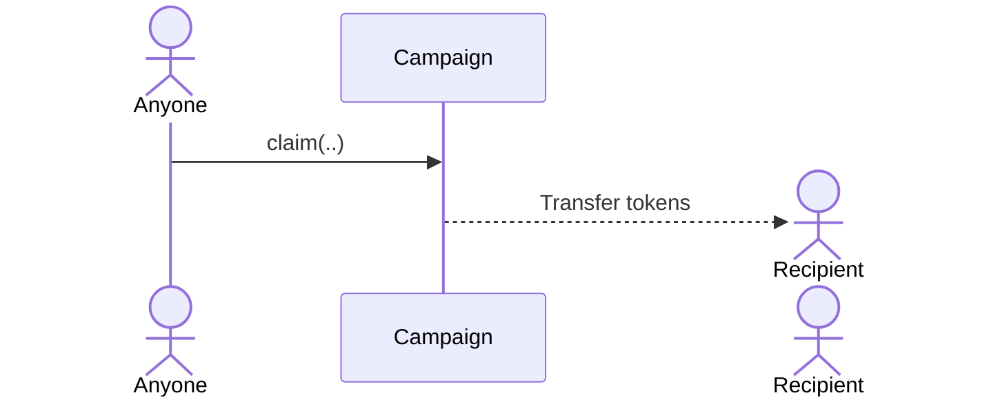
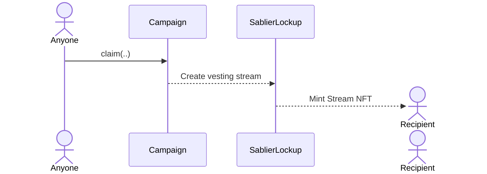
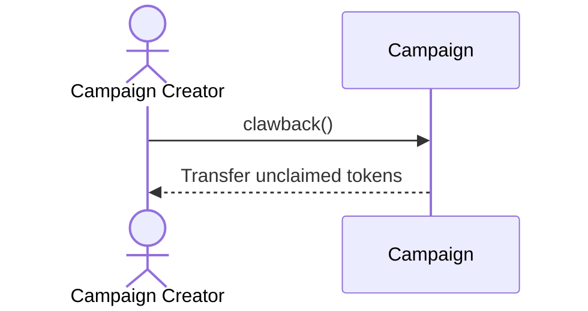

With the exception of the [admin functions](/concepts/governance#merkle-airdrops), all functions in Merkle campaign can
only be triggered either by the campaign creator or the airdrop recipients. The Protocol Admin has no control over any
funds in the campaign contract.

This article will provide a comprehensive overview of the actions that can be performed on a campaign contract.

:::note

Every campaign has a creator and a recipient. An 'public' caller is any address outside of creator and recipient. Anyone
can call `claim` function on a campaign but the tokens will be transferred to the recipient.

:::

## Overview

The table below offers a quick overview of the access control for each action that can be performed on a campaign.

| Action   | Creator | Recipient | Public |
| -------- | :-----: | :-------: | :----: |
| Claim    |   ✅    |    ✅     |   ✅   |
| Clawback |   ✅    |    ❌     |   ❌   |

## Claim

Claiming an airdrop requires four values:

1. Address of the eligible user
1. Amount that the user is eligible for
1. Claim index in the bitmap
1. Merkle proof

Anybody can `claim` function with the correct set of values. The `claim` then automatically transfers amount of tokens
to the eligible user.

If the campaign requires token vesting, then the `claim` function will create a Sablier stream on behalf of the eligible
user.

## Clawback

Only the campaign creator can clawback funds within grace period.

