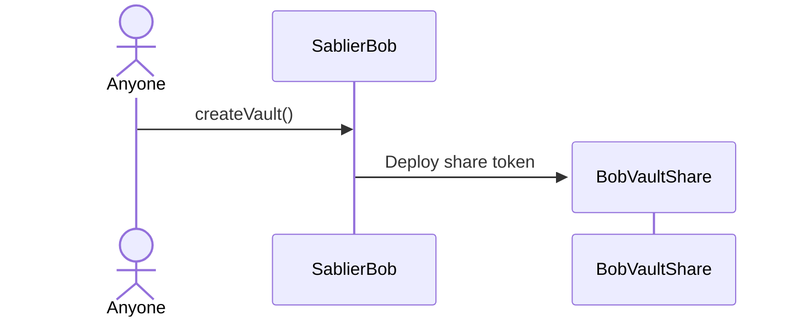
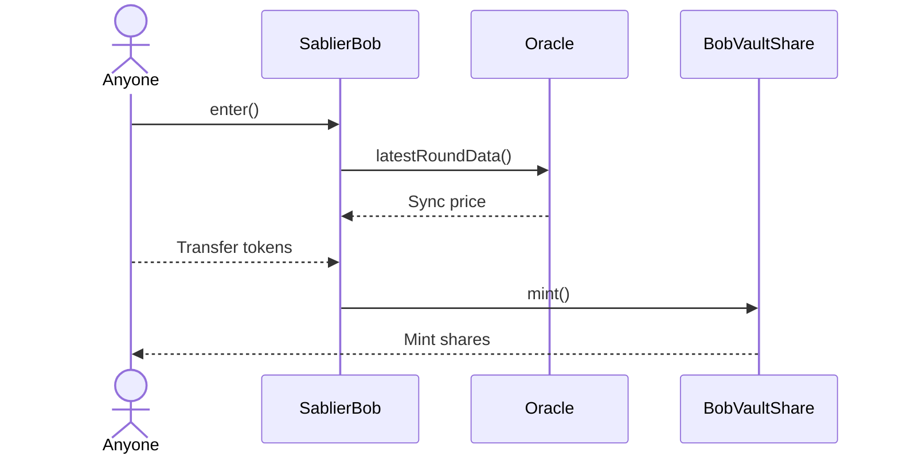
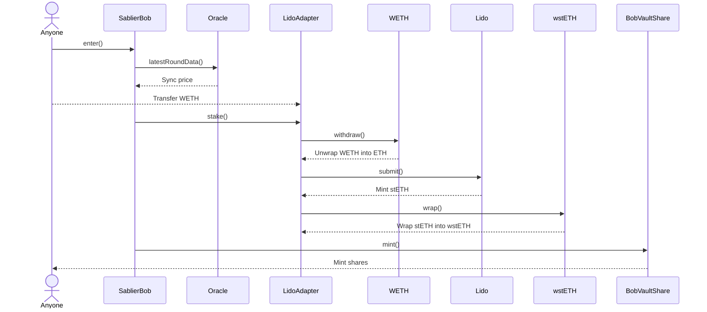
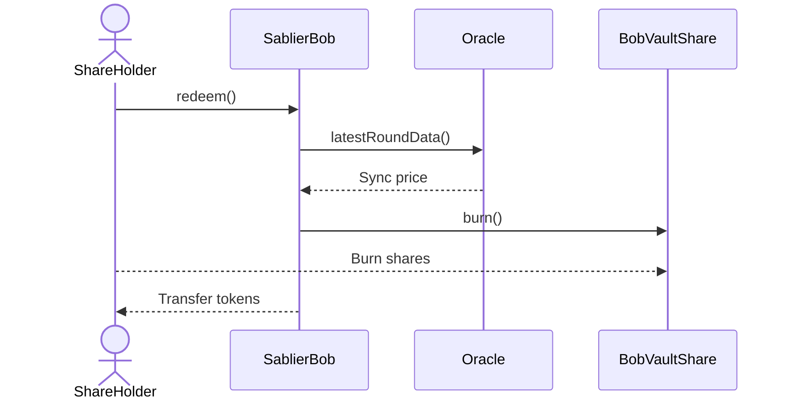
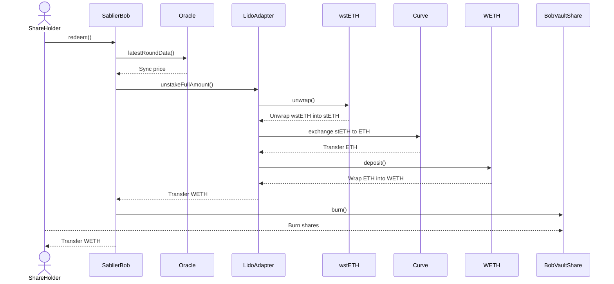
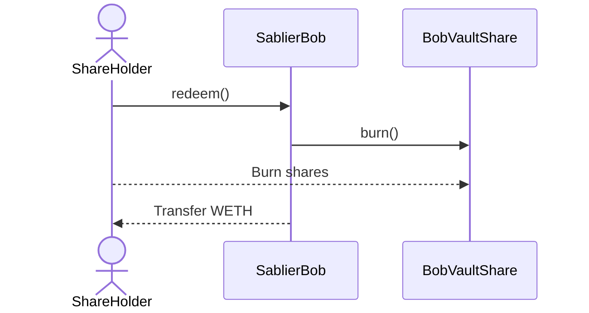
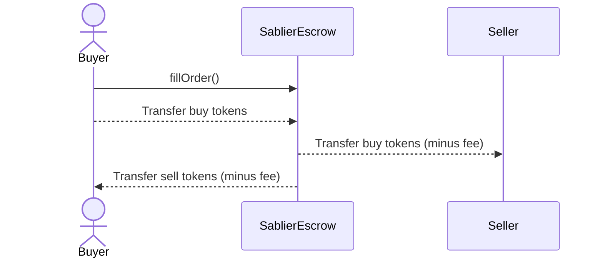
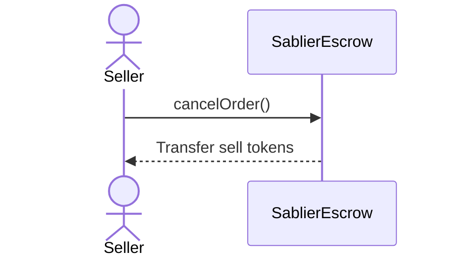

## Token Flows in Bob

### Creating a Vault

### Depositing Tokens

### Depositing Tokens (with Lido adapter)

### Redeeming Shares

### Redeeming Shares (With Lido Adapter)

First user who redeems shares unstakes from Lido adapter.

Subsequent users receives WETH directly from the Bob contract.

## Token Flows in Escrow

### Creating an Order

### Filling an Order

### Cancelling an Order

