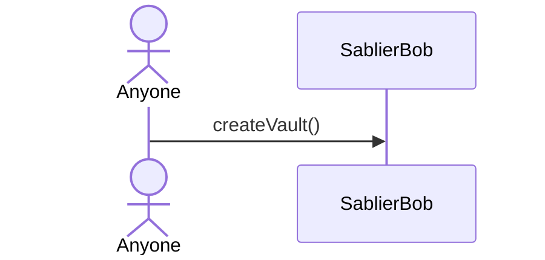
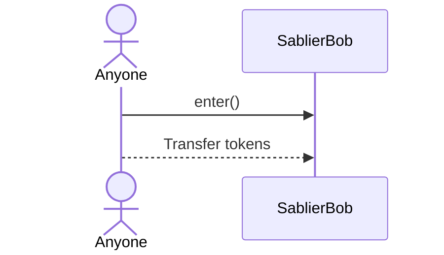
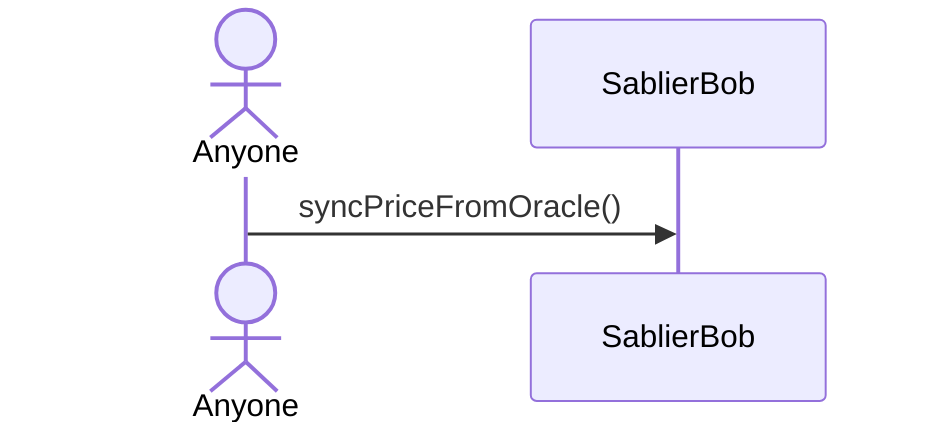
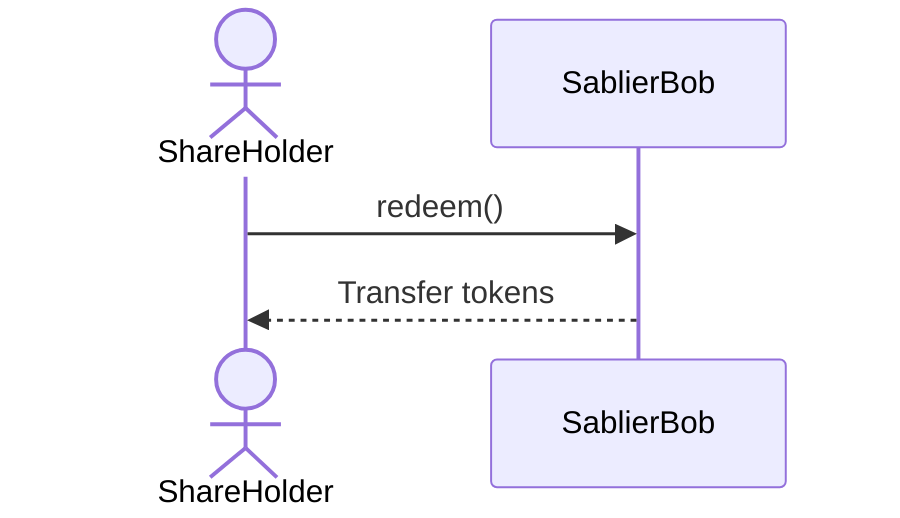
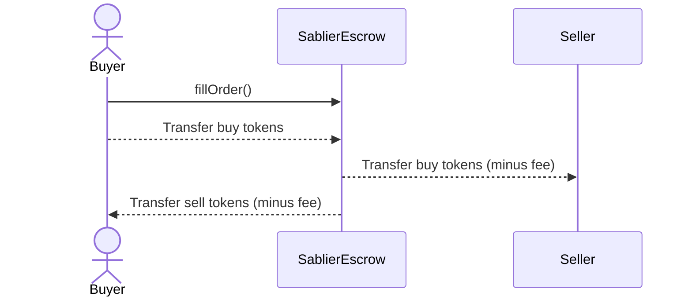
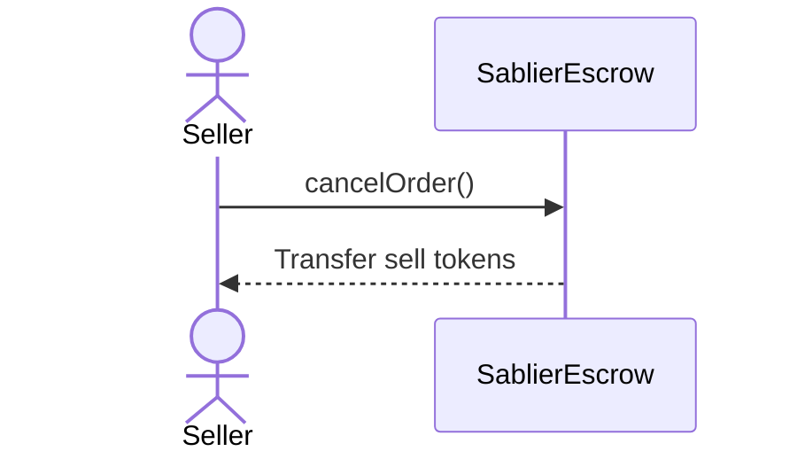

With the exception of the [admin functions](/concepts/governance#bob), all functions in Bob and Escrow can be triggered
by users. The Comptroller has no control over any vault, order, or deposited tokens.

## Bob

| Action              | Anyone | Share Holder | Comptroller |
| ------------------- | :----: | :----------: | :---------: |
| Create Vault        |   ✅   |      ✅      |     ✅      |
| Enter               |   ✅   |      ✅      |     ✅      |
| Enter with Native   |   ✅   |      ✅      |     ✅      |
| Sync Price          |   ✅   |      ✅      |     ✅      |
| Unstake via Adapter |   ✅   |      ✅      |     ✅      |
| Redeem              |   ❌   |      ✅      |     ❌      |
| Transfer Shares     |   ❌   |      ✅      |     ❌      |
| Set Default Adapter |   ❌   |      ❌      |     ✅      |
| Set Native Token    |   ❌   |      ❌      |     ✅      |

### Create Vault

Anyone can create a vault.

### Enter

Anyone can deposit tokens into an active vault.

### Sync Price

Anyone can trigger a price sync on any active vault.

### Redeem

Only a share holder can redeem from a settled or expired vault.

## Escrow

For orders with buyer specified:

| Action           | Seller | Buyer | Comptroller |
| ---------------- | :----: | :---: | :---------: |
| Create Order     |   ✅   |  ✅   |     ✅      |
| Fill Order       |   ❌   |  ✅   |     ❌      |
| Cancel Order     |   ✅   |  ❌   |     ❌      |
| Set Trade Fee    |   ❌   |  ❌   |     ✅      |
| Set Native Token |   ❌   |  ❌   |     ✅      |

For orders with no buyer specified:

| Action           | Seller | Buyer | Comptroller |
| ---------------- | :----: | :---: | :---------: |
| Create Order     |   ✅   |  ✅   |     ✅      |
| Fill Order       |   ✅   |  ✅   |     ✅      |
| Cancel Order     |   ✅   |  ❌   |     ❌      |
| Set Trade Fee    |   ❌   |  ❌   |     ✅      |
| Set Native Token |   ❌   |  ❌   |     ✅      |

### Create Order

Anyone can create an escrow order.

### Fill Order

For orders with buyer specified:

For orders with no buyer specified:

### Cancel Order

Only the seller can cancel an unfilled order.

