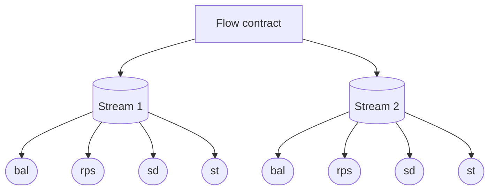
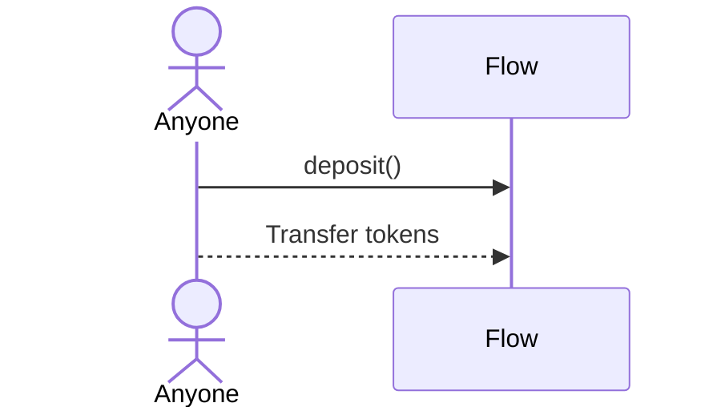
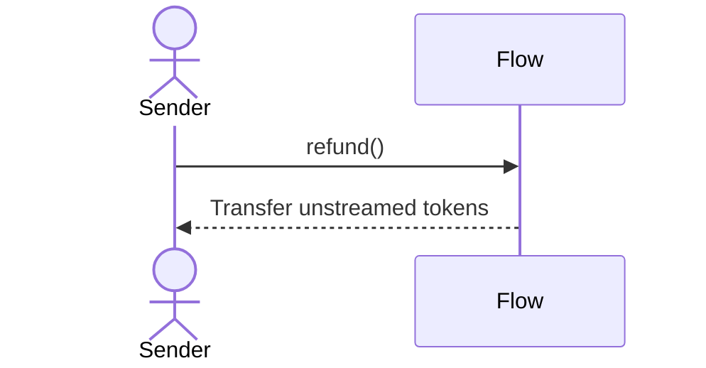
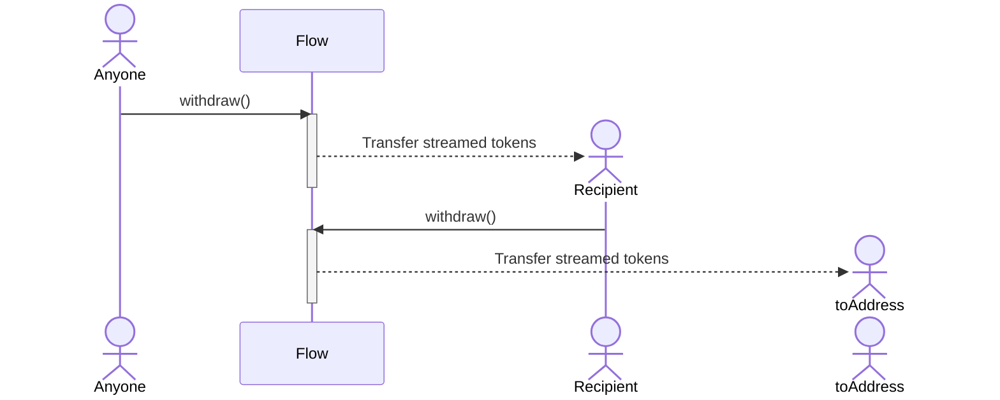
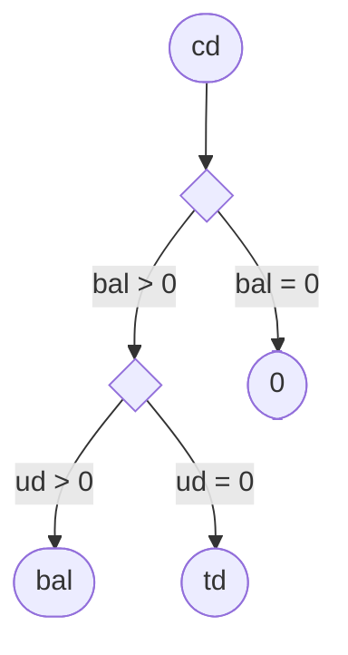
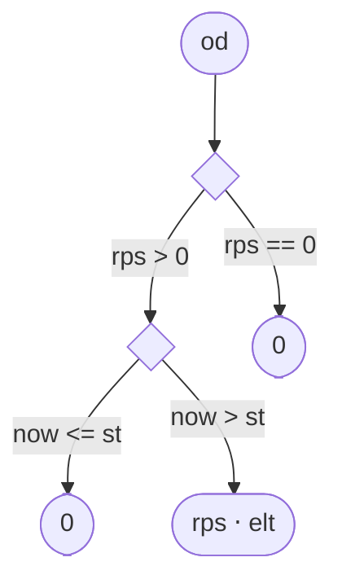
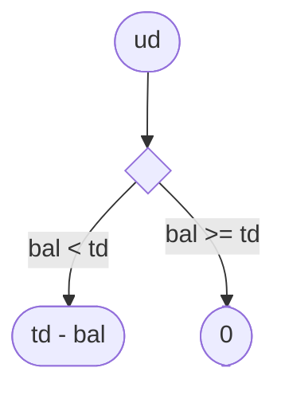
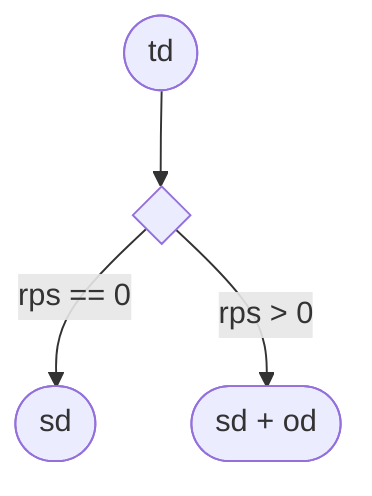
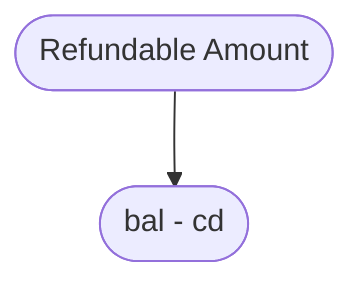

## Abbreviations

| Abbreviation | Full name       | Description                                                 |
| ------------ | --------------- | ----------------------------------------------------------- |
| bal          | Stream balance  | Balance of the stream                                       |
| cd           | Covered debt    | Portion of the total debt covered by the stream balance     |
| elt          | Elapsed time    | Time elapsed in seconds since the last snapshot             |
| od           | Ongoing debt    | Debt accumulated since the last snapshot                    |
| now          | Current time    | Same as `block.timestamp`                                   |
| rps          | Rate per second | Rate at which tokens are streamed per second                |
| sd           | Snapshot debt   | Debt accumulated until the last snapshot                    |
| st           | Snapshot time   | Time of the last snapshot                                   |
| td           | Total debt      | Sum of sd and od, also same as sum of cd and ud             |
| ud           | Uncovered debt  | Portion of the total debt not covered by the stream balance |

## Flow Storage Layout

The Flow is a singleton contract that stores all streams created by that contract's users. The following diagrams
provide insight into the storage layout of each stream. To see the full list of storage variables,
[click here](/reference/flow/contracts/types/library.Flow#structs).

## Token Flows

The following three functions lead to tokens flow in and out of a stream:

### Deposit

Anyone can deposit into a stream.

### Refund

Only sender can refund from the stream that he created.

### Withdraw

Anyone can call withdraw on a stream as long as `to` address matches the recipient. If recipient/operator is calling
withdraw on a stream, they can choose to withdraw to any address.

## Debts

### Covered debt

### Ongoing Debt

### Uncovered Debt

### Total Debt

## Refundable Amount

