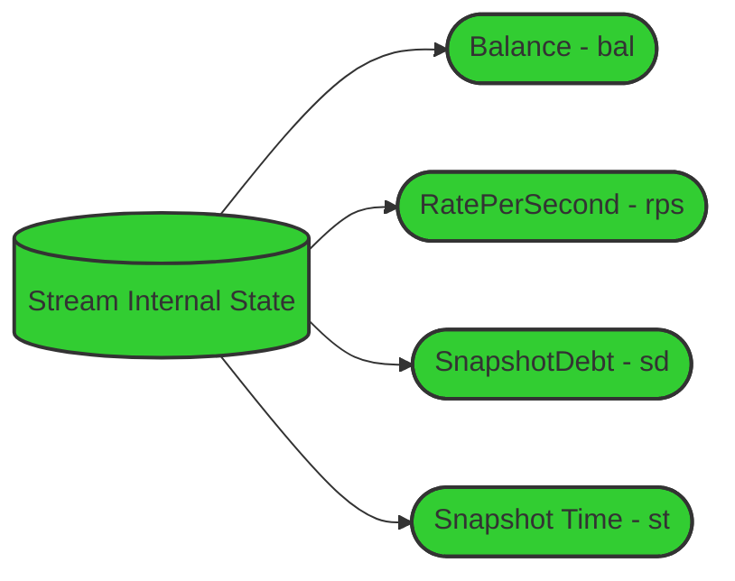
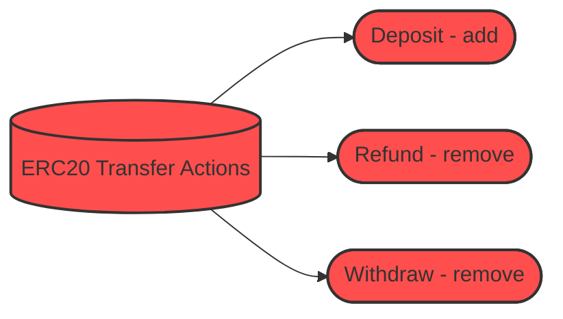
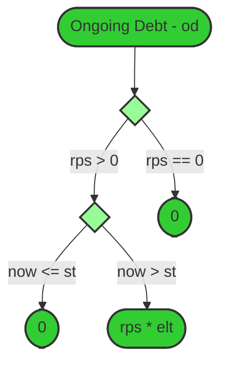
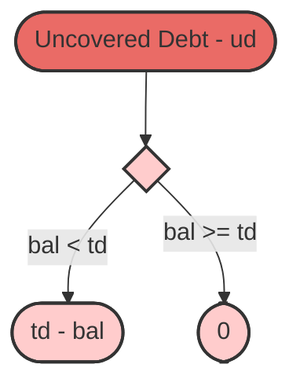
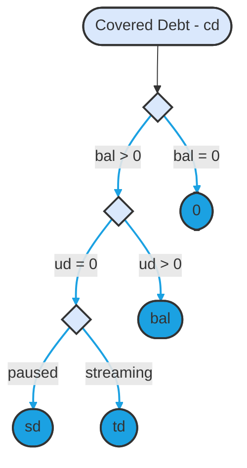
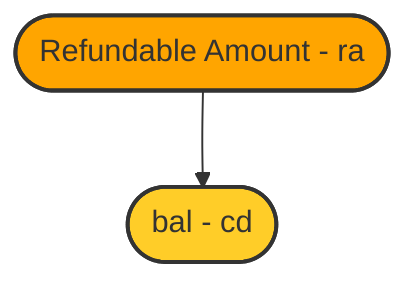

## Flow Storage Layout

Each Flow contract is a singleton that stores all streams created by that contract's users. The following diagrams
provide insight into the storage layout. To see the list of all storage variables,
[click here](/reference/flow/contracts/types/library.Flow#structs).

### Function calls

**Notes:**

1. The arrows point to the status on which the function can be called.
2. The "update" comments refer only to the stream internal state.
3. `st` is always updated to `block.timestamp`.
4. Red lines refers to the function that are doing an `ERC-20` transfer

```mermaid
flowchart LR
    subgraph Statuses
        NULL((NULL)):::grey
        STR((STREAMING)):::green
        PSED((PAUSED)):::yellow
        VOID((VOIDED)):::red
    end

    subgraph Functions
        CR([CREATE])
        ADJRPS([ADJUST_RPS])
        DP([DEPOSIT])
        PS([PAUSE])
        RST([RESTART])
        VD([VOID])
        RFD([REFUND])
        WTD([WITHDRAW])
    end

    BOTH((  )):::black


    classDef black fill:#000000,stroke:#333,stroke-width:2px;
    classDef green fill:#32cd32,stroke:#333,stroke-width:2px;
    classDef grey fill:#b0b0b0,stroke:#333,stroke-width:2px;
    classDef yellow fill:#ffff99,stroke:#333,stroke-width:2px;
    classDef red fill:#ff4e4e,stroke:#333,stroke-width:2px;

    CR -- "update rps<br/>update st" --> NULL

    ADJRPS -- "update sd (+od)<br/>update rps<br/>update st" -->  STR

    DP -- "update bal (+)" --> BOTH

    RFD -- "update bal (-)" --> BOTH
    RFD -- "update bal (-)" --> VOID

    PS -- "update sd (+od)<br/>update rps (0)<br/>update st" --> STR

    BOTH --> STR & PSED

    RST -- "update rps<br/>update st" --> PSED

    VD -- "update sd (bal || +od)<br/>update rps (0)<br/>update st" --> BOTH

    WTD -- "update sd (-)<br/>update st<br/>update bal (-)" --> BOTH
    WTD -- "update sd (-)" --> VOID

    linkStyle 2,3,4,10,11 stroke:#ff0000,stroke-width:2px
```

### Internal State

The
[stream struct](https://github.com/sablier-labs/flow/blob/ba1c9ba64907200c82ccfaeaa6ab91f6229c433d/src/types/DataTypes.sol#L61-L76)
has more fields than the ones shown here, but these are the most relevant ones.

### ERC-20 Transfer Actions

$~$

## Amount Calculations

### Ongoing Debt

### Uncovered Debt

**Notes:** A non-zero uncovered debt implies:

1. `bal < sd` when the status is `PAUSED`
2. `bal < sd + od` when the status is `STREAMING`

### Covered debt

### Refundable Amount

