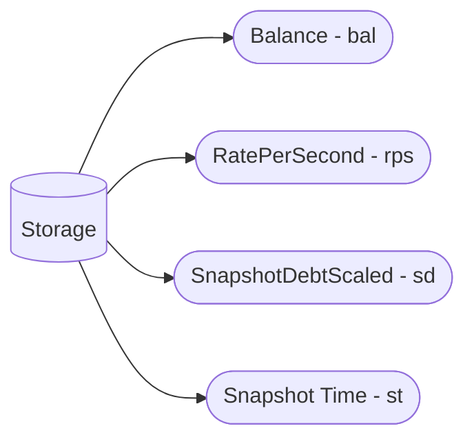

## Flow Storage Layout

Each Flow contract is a singleton that stores all streams created by that contract's users. The following diagrams
provide insight into the storage layout. To see the list of all storage variables,
[click here](/reference/flow/contracts/types/library.Flow#structs).

## Token Flows

## Flow Actors with Actions

## Debts

### Ongoing Debt

### Total Debt

### Uncovered Debt

### Covered debt

### Refundable Amount

