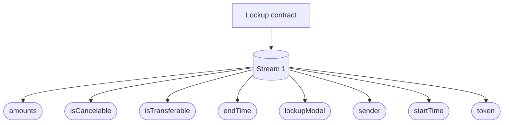
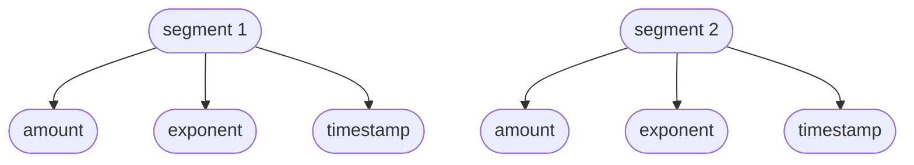
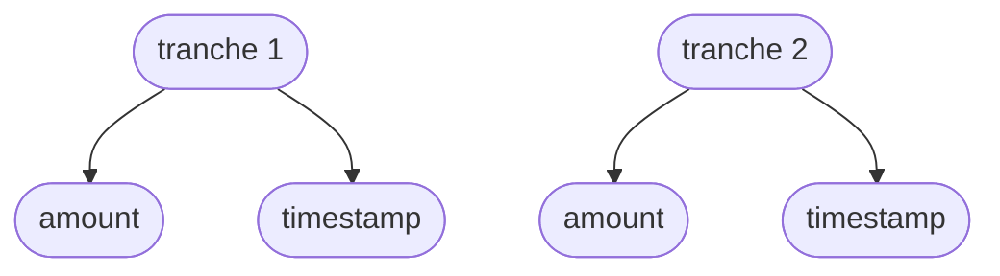

## Common Storage Layout

Lockup is a singleton contract that stores all streams created by that contract's users. The following diagrams provide
insight into the shared storage layout of each stream. To see the full list of storage variables, check out
[this reference](/reference/lockup/contracts/types/library.Lockup#structs).

Each [amounts storage](/reference/lockup/contracts/types/library.Lockup#amounts) is made of the following components:

:::info

Each stream belongs to one of the three models: Linear, Dynamic and Tranched. Each of these model has its own storage as
outlined below.

:::

## Linear Stream

Apart from the above storage layout, Linear stream requires storing
[unlock amounts](/reference/lockup/contracts/types/library.LockupLinear#unlockamounts) and cliff time.

## Dynamic Stream

Similarly, Dynamic stream requires an array of
[segments](/reference/lockup/contracts/types/library.LockupDynamic#segment).

Where each segment is made of three components:

## Tranched Stream

A Tranched stream requires an array of [tranches](/reference/lockup/contracts/types/library.LockupTranched#tranche).

Where each tranche is made of two components:

