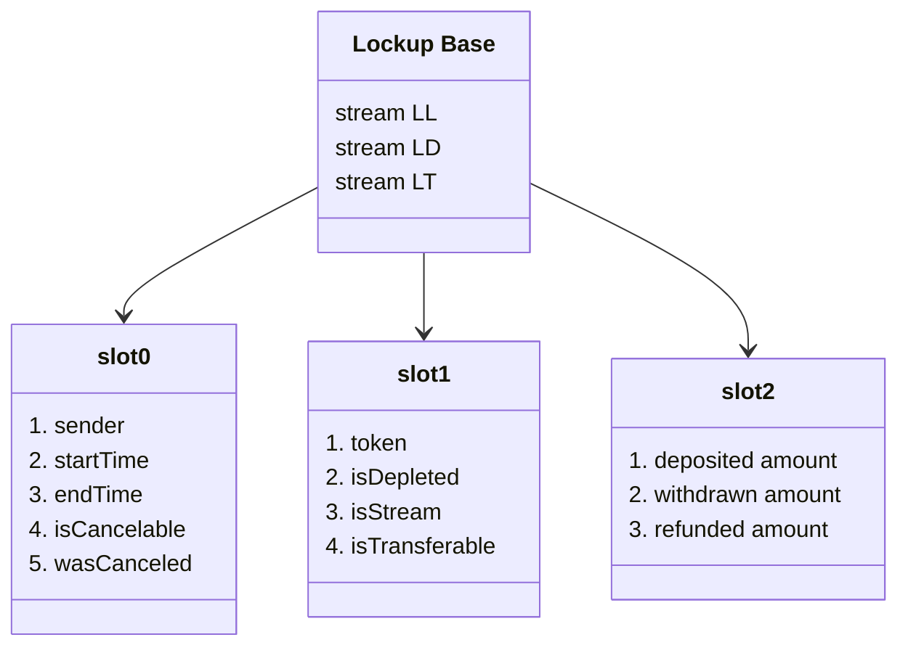
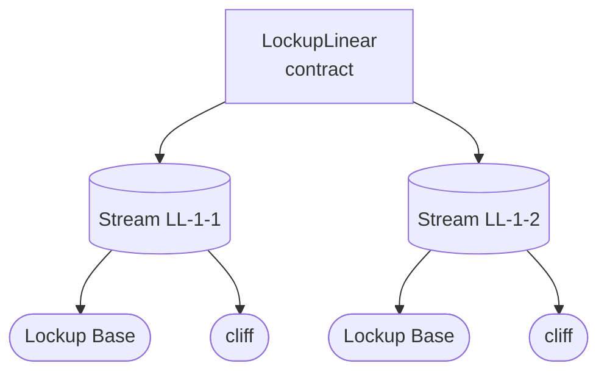
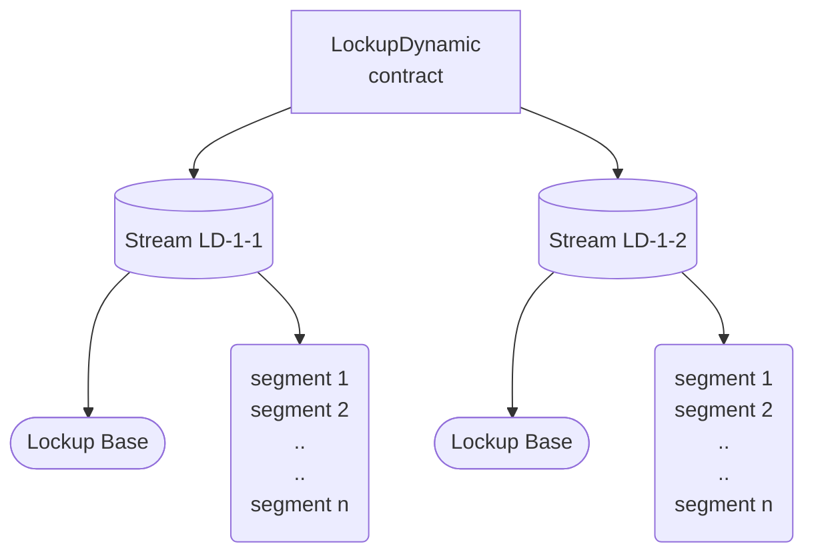
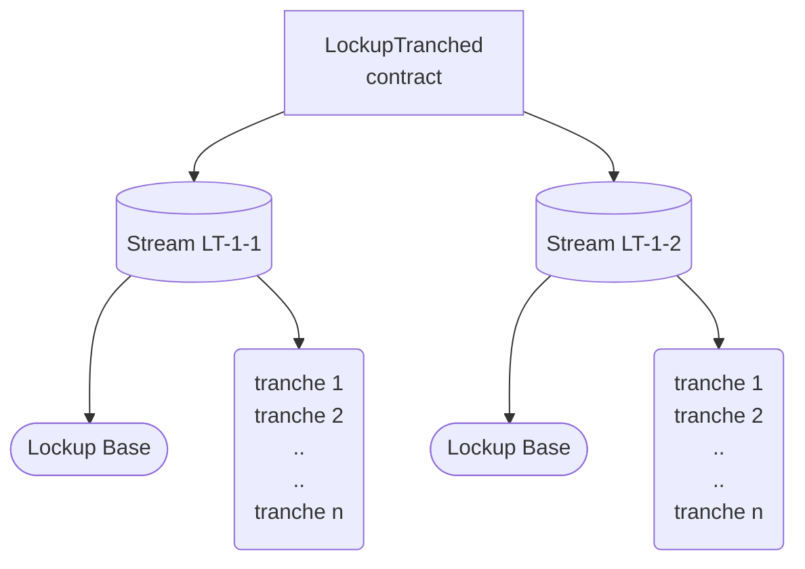
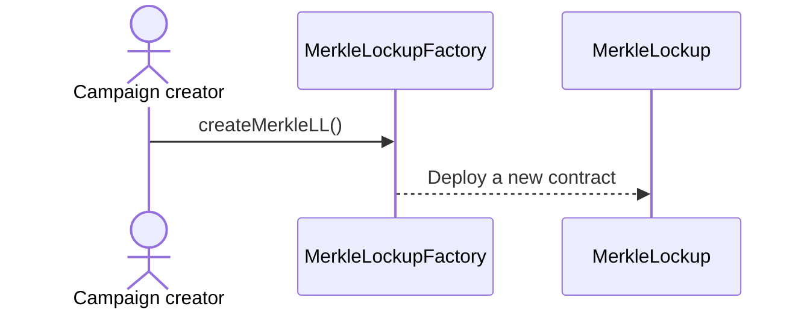
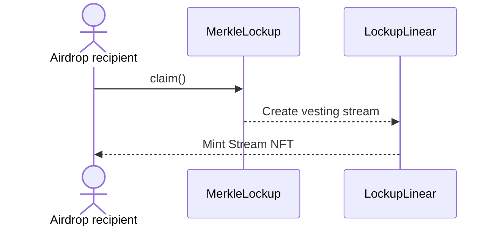
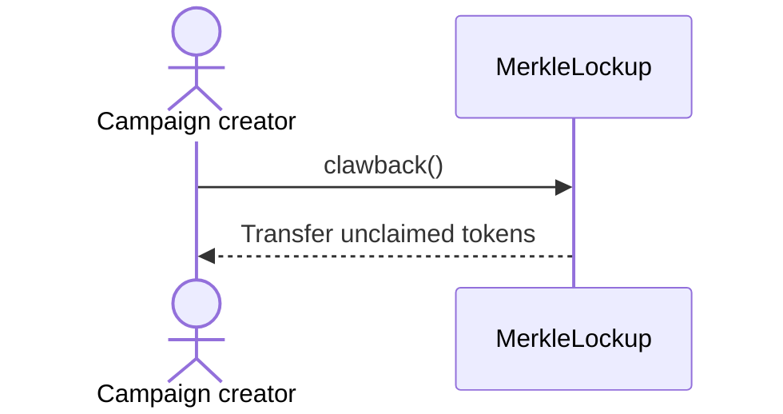

## Lockup Storage Layout

Each Lockup contract is a singleton that stores all streams created by that contract's users. The following diagrams
provide insight into the storage layout.

### Lockup Base

To see the list of all common storage variables, [click here](/reference/lockup/core/types/library.Lockup#stream). This
struct is shared across LockupLinear, LockupDynamic, and LockupTranched.

### Lockup Linear

Apart from the shared Lockup storage, Lockup Linear requires a
[separate storage](/reference/lockup/core/contract.SablierV2LockupLinear#_cliffs) to store cliff details for each stream
ID.

### Lockup Dynamic

Similarly, Lockup Dynamic requires a
[separate storage](/reference/lockup/core/contract.SablierV2LockupDynamic#_segments) to store an array of
[segments](/reference/lockup/core/types/library.LockupDynamic#segment) for each stream ID.

### Lockup Tranched

Lockup Tranched requires a [separate storage](/reference/lockup/core/contract.SablierV2LockupTranched#_tranches) to
store an array of [tranches](/reference/lockup/core/types/library.LockupTranched#tranche) for each stream ID.

## Airstream Campaign

A typical Airstream campaign creation flow looks like the following:

And this is how the claim flow looks like for recipients:

For campaign admins, we offer `clawback` functionality which can be used to retrieve unclaimed funds after expiration.
There is also a grace period that ends 7 days after the first claim is made. During the grace period, admin can
`clawback` to return funds from the `MerkleLockup` contract. This is useful in case there had been an accidental
transfer of funds.

