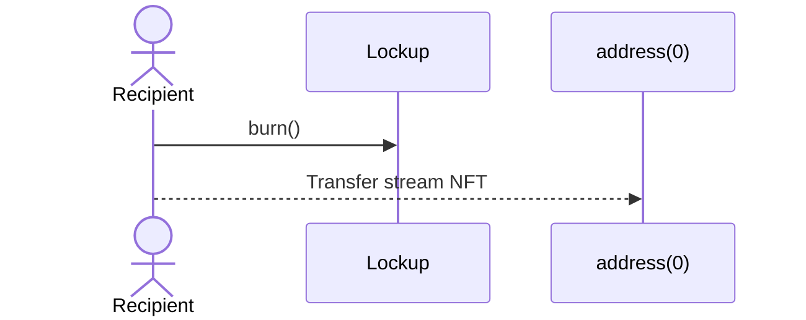
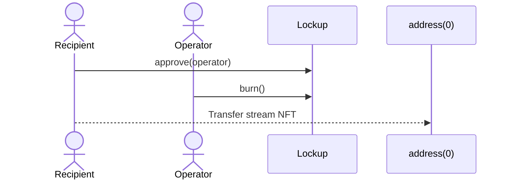
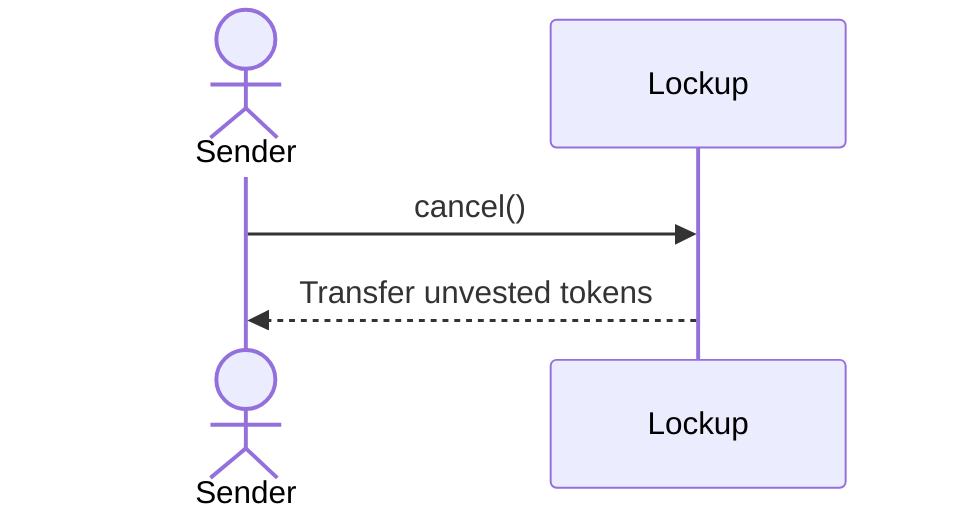
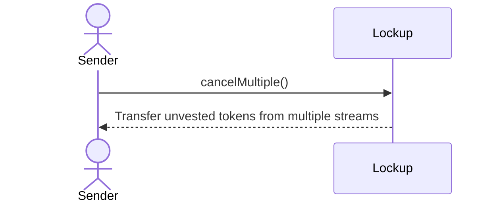
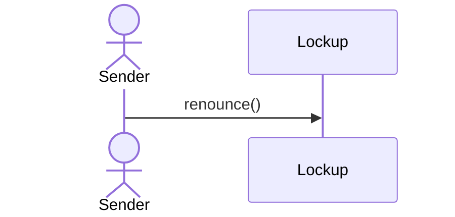
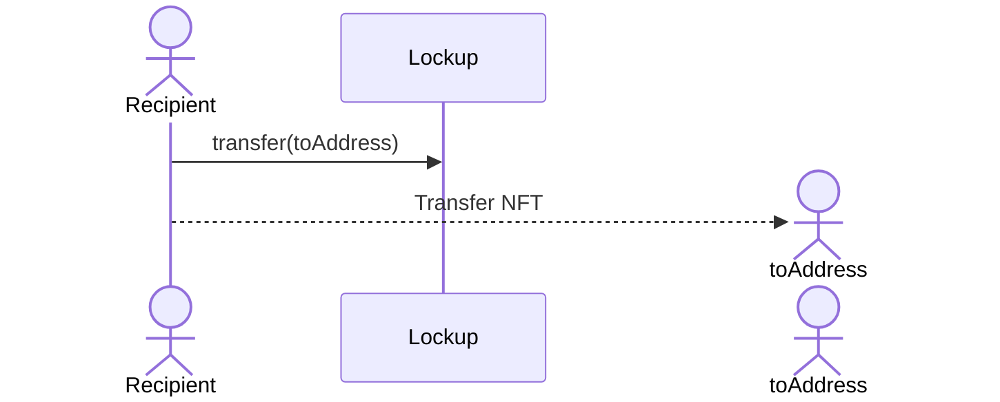
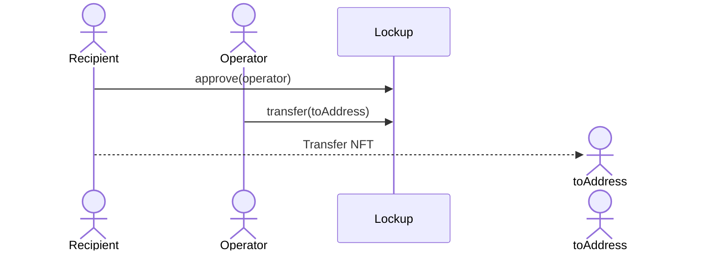
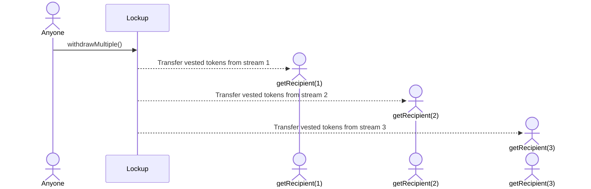
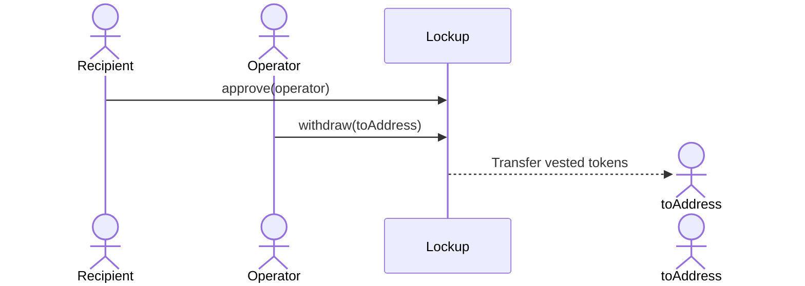
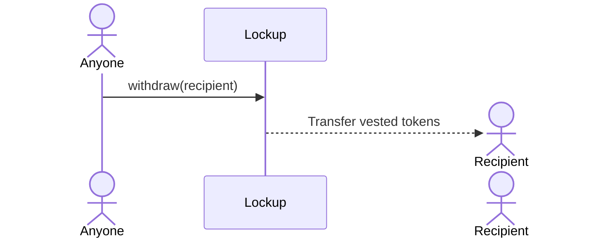

With the exception of the [admin functions](/concepts/governance#lockup), all functions in Lockup can only be triggered
by users. The Protocol Admin has no control over any stream or any part of the protocol.

This article will provide a comprehensive overview of the actions that can be performed on streams once they are
created, as well as the corresponding user permissions for each action.

:::note

Every stream has a sender and a recipient. Recipients can approve third parties to take actions on their behalf. An
'public' caller is any address outside of sender and recipient.

:::

## Overview

The table below offers a quick overview of the access control for each action that can be performed on a stream.

| Action                  | Sender | Recipient / Approved third party | Public |
| ----------------------- | :----: | :------------------------------: | :----: |
| Burn NFT                |   ❌   |                ✅                |   ❌   |
| Cancel                  |   ✅   |                ❌                |   ❌   |
| Cancel Multiple         |   ✅   |                ❌                |   ❌   |
| Renounce                |   ✅   |                ❌                |   ❌   |
| Transfer NFT            |   ❌   |                ✅                |   ❌   |
| Withdraw to any address |   ❌   |                ✅                |   ❌   |
| Withdraw to recipient   |   ✅   |                ✅                |   ✅   |
| Withdraw Multiple       |   ✅   |                ✅                |   ✅   |

## Burn NFT

Either the recipient or an approved operator can burn the NFT associated with a stream.

#### With Operator:

## Cancel

Only the sender can cancel a stream.

## Cancel Multiple

Only the sender can cancel multiple streams.

## Renounce

Only the sender can renounce a stream.

## Transfer NFT

Either the recipient or an approved operator can transfer the NFT associated with a stream.

- Only if the stream is transferable.

#### With Operator:

## Withdraw Multiple

Anybody can withdraw tokens from multiple streams to the recipients of each stream.

## Withdraw to Any Address

The tokens in a stream can be withdrawn to any address only by the recipient or an approved third party.

#### With Operator:

## Withdraw to Recipient

The tokens in a stream can be withdrawn to the recipient by anyone including the sender, recipient, or an approved third
party.

