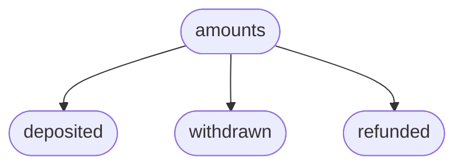

This section covers the program architecture, as well as the account structure and the token flow for the most important
instructions of the Lockup program.

## Program Architecture

The `sablier_lockup` program implements these main functionalities:

- `initialize`
- `create_stream`
- `cancel`
- `withdraw`
- `renounce`

The `create_stream` functionality is represented by the `create_with_timestamps_ll` and `create_with_durations_ll`
instructions. The difference between them is the different kind of inputs required from the ix caller to create the
stream. However, both of them create the same accounts and store the same data on-chain.

## Ix Account Architecture

The following sections detail the accounts created by each instruction.

### `initialize` Instruction

- **NFT collection data PDA**: stores collection configuration and metadata
- **NFT collection mint PDA**: serves as the master mint authority for all stream NFTs
- **NFT collection metadata PDA**: created via Metaplex CPI
- **NFT collection master edition PDA**: created via Metaplex CPI
- **NFT collection ATA**: associated token account owned by treasury to hold the collection NFT token

The
[Treasury PDA](https://github.com/sablier-labs/solsab/blob/e1085fe87ea3d02556156ee446e820d150af483e/programs/lockup/src/state/treasury.rs#L5-L10)
stores this data:

### `create_with_timestamps_ll` Instruction

#### Pre-existing accounts required:

- Deposit Token
- NFT Collection

The **Stream NFT Mint** also serves as the "Stream ID" for the `cancel`, `renounce`, and `withdraw` instructions.

Each
[Stream Data](https://github.com/sablier-labs/solsab/blob/e1085fe87ea3d02556156ee446e820d150af483e/programs/lockup/src/state/lockup.rs#L14-L24)
account stores the following parameters:

Each
[amount](https://github.com/sablier-labs/solsab/blob/e1085fe87ea3d02556156ee446e820d150af483e/programs/lockup/src/state/lockup.rs#L4-L10)
data structure consists of the following components:

Each
[timestamps](https://github.com/sablier-labs/solsab/blob/e1085fe87ea3d02556156ee446e820d150af483e/programs/lockup/src/state/lockup.rs#L28-L32)
data structure consists of the following components:

## Deposit Token Flow

At stream creation, the deposit token is transferred from the sender to the stream's token account. Then, as it's being
streamed, it can be withdrawn by the recipient. If the stream is canceled, the unstreamed token amount is refunded to
the sender. The following diagrams illustrate how tokens move between accounts when each instruction is executed.

### `create_with_timestamps_ll` Instruction

At stream creation, the deposit tokens are transferred from the sender's associated token account (ATA) to the stream
data's ATA, where they are stored until withdrawn or refunded.

### `cancel` Instruction

Only the sender can cancel a stream. When canceled, any remaining/unstreamed tokens are refunded from the stream data's
ATA to the sender's ATA.

### `withdraw` Instruction

The recipient can withdraw their available/streamed tokens at any time. The tokens are transferred from the stream
data's ATA to the specified withdrawal recipient's ATA (which may be the recipient themselves or another account,
depending on the authority of the tx signer).

