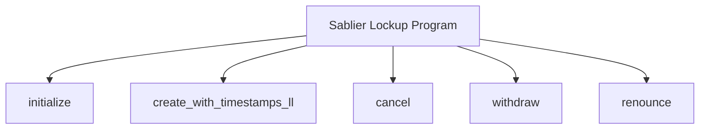
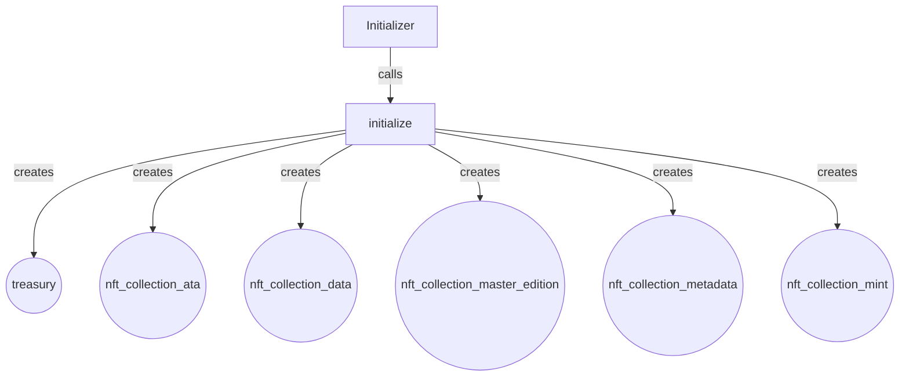
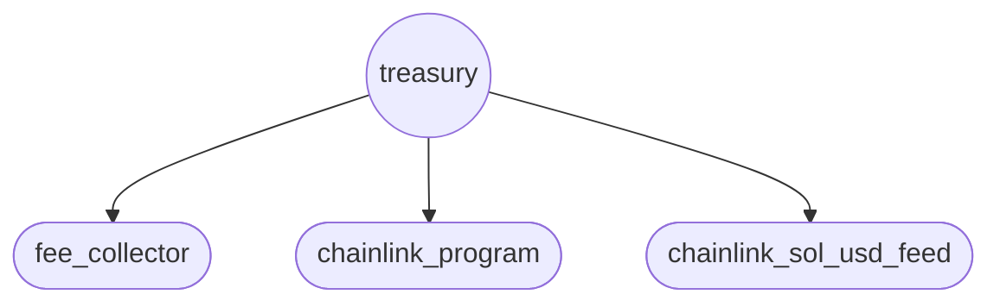
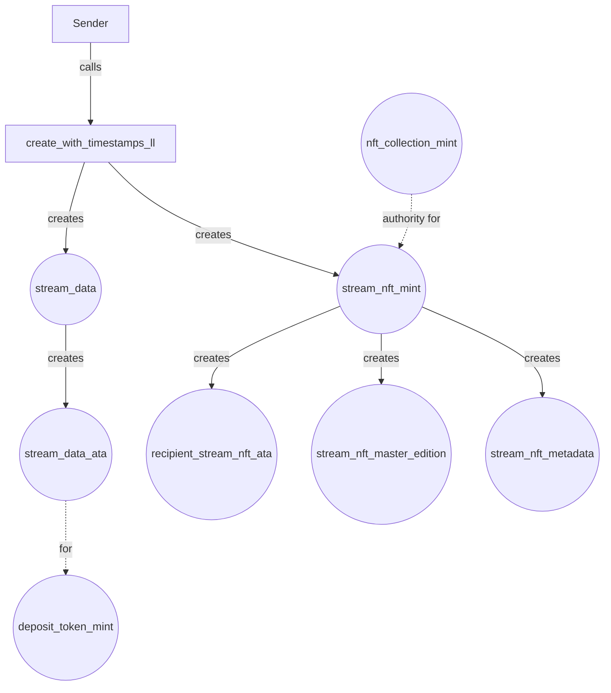
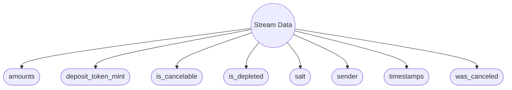
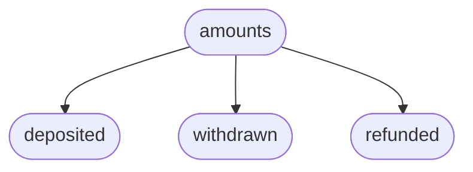
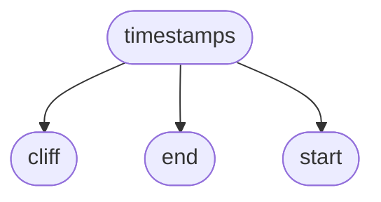
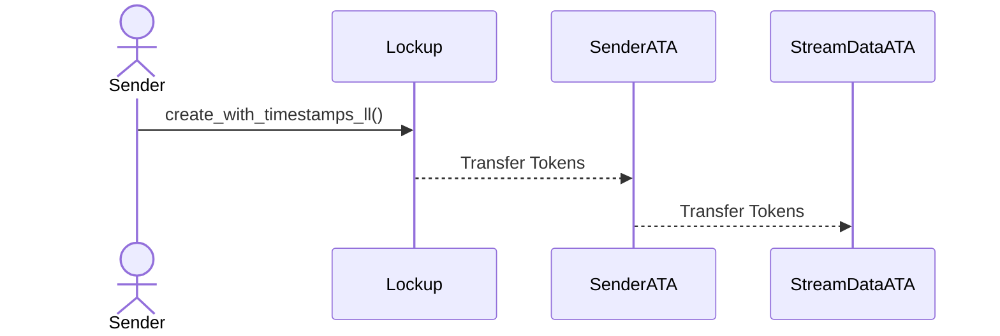
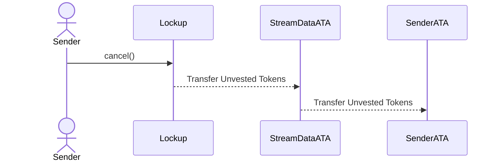
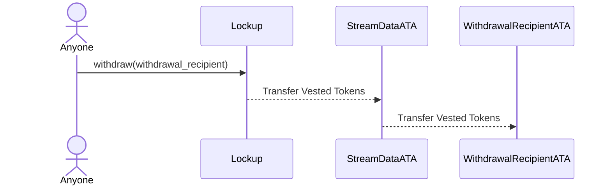

This section focuses on the architecture of accounts created or used in the most important instructions of the Sablier
Lockup program.

## Account architecture

### Sablier Lockup program

The `sablier_lockup` program implements these main functionalities:

- `initialize`
- `create_with_timestamps_ll`
- `cancel`
- `withdraw`
- `renounce`

We will go into the details and specifics of each one later. For now, we will focus only on the accounts being created.

### `initialize` Instruction

- **NFT collection data PDA**: stores collection configuration and metadata
- **NFT collection mint PDA**: serves as the master mint authority for all stream NFTs
- **NFT collection metadata PDA**: created via Metaplex CPI
- **NFT collection master edition PDA**: created via Metaplex CPI
- **NFT collection ATA**: associated token account owned by treasury to hold the collection NFT token

The **Treasury PDA** stores this data:

### `create_with_timestamps_ll` Instruction

#### Pre-existing accounts required:

- Deposit Token
- NFT Collection

The **Stream NFT Mint** also serves as the "Stream ID" for the `cancel`, `renounce`, and `withdraw` instructions.

Each **Stream Data** account stores the following parameters:

Each `amount` data structure consists of the following components:

Each `timestamps` data structure consists of the following components:

## Deposit Token Flow

### `create_with_timestamps_ll` Instruction

### `cancel` Instruction

Only the sender can cancel a stream.

### `withdraw` Instruction

