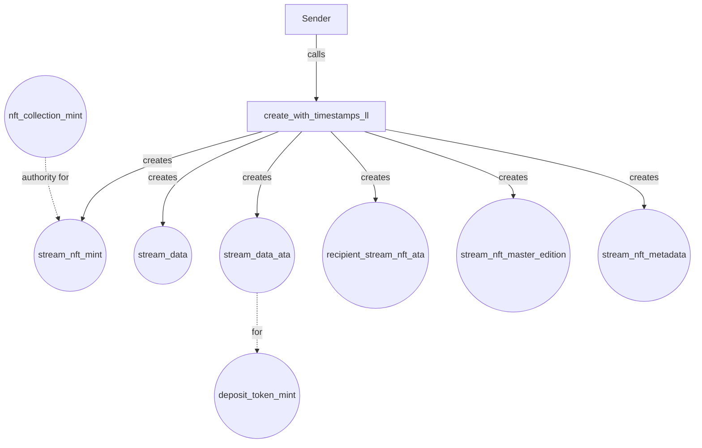
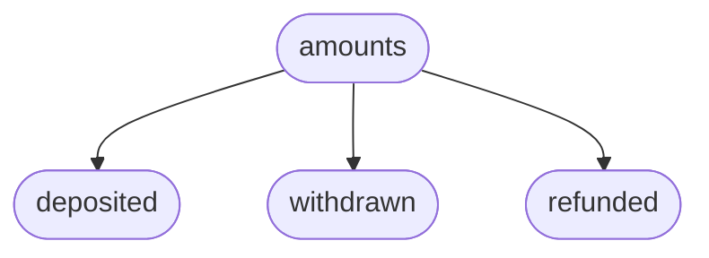
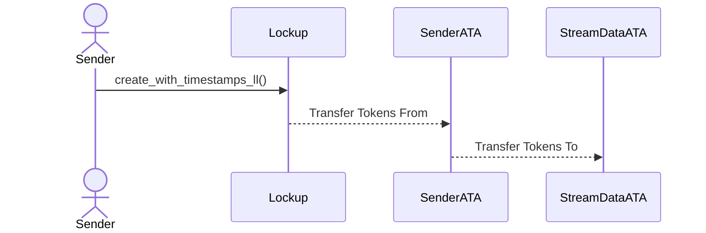
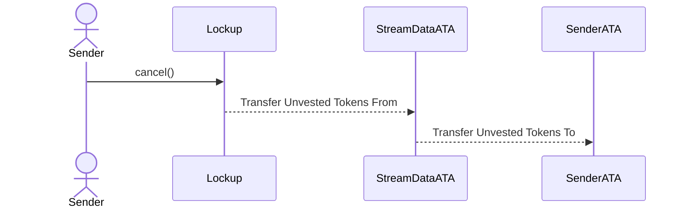
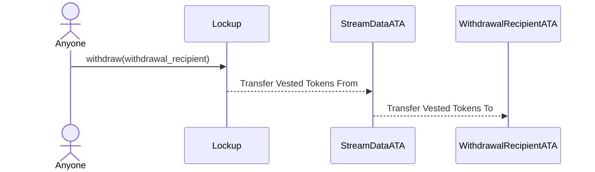

This section focuses on the architecture of accounts created or used in the most important instructions of the Lockup
program.

## Account architecture

### Sablier Lockup program

The `sablier_lockup` program implements these main functionalities:

- `initialize`
- `create_with_timestamps_ll`
- `cancel`
- `withdraw`
- `renounce`

We will go into the details and specifics of each one later. For now, we will focus only on the accounts being created.

### `initialize` Instruction

- **NFT collection data PDA**: stores collection configuration and metadata
- **NFT collection mint PDA**: serves as the master mint authority for all stream NFTs
- **NFT collection metadata PDA**: created via Metaplex CPI
- **NFT collection master edition PDA**: created via Metaplex CPI
- **NFT collection ATA**: associated token account owned by treasury to hold the collection NFT token

The
[Treasury PDA](https://github.com/sablier-labs/solsab/blob/e1085fe87ea3d02556156ee446e820d150af483e/programs/lockup/src/state/treasury.rs#L5-L10)
stores this data:

### `create_with_timestamps_ll` Instruction

#### Pre-existing accounts required:

- Deposit Token
- NFT Collection

The **Stream NFT Mint** also serves as the "Stream ID" for the `cancel`, `renounce`, and `withdraw` instructions.

Each
[Stream Data](https://github.com/sablier-labs/solsab/blob/e1085fe87ea3d02556156ee446e820d150af483e/programs/lockup/src/state/lockup.rs#L14-L24)
account stores the following parameters:

Each
[amount](https://github.com/sablier-labs/solsab/blob/e1085fe87ea3d02556156ee446e820d150af483e/programs/lockup/src/state/lockup.rs#L4-L10)
data structure consists of the following components:

Each
[timestamps](https://github.com/sablier-labs/solsab/blob/e1085fe87ea3d02556156ee446e820d150af483e/programs/lockup/src/state/lockup.rs#L28-L32)
data structure consists of the following components:

## The Flow of the Deposit Token

### `create_with_timestamps_ll` Instruction

### `cancel` Instruction

Only the sender can cancel a stream.

### `withdraw` Instruction

