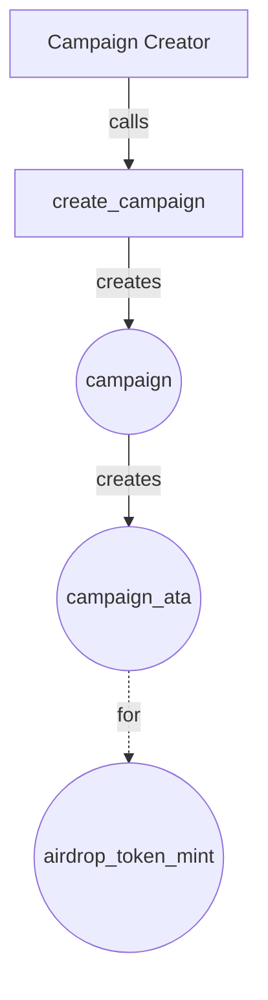
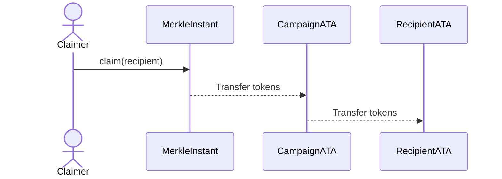
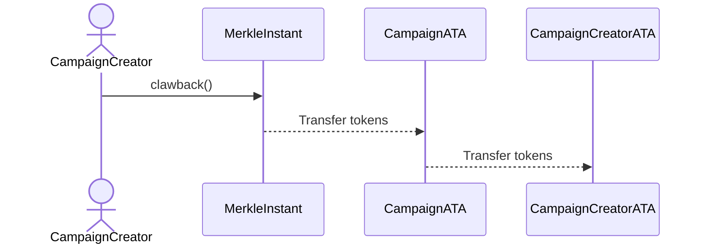

This section focuses on the architecture of accounts created or used in the most important instructions of the Sablier
Merkle Instant program.

## Account architecture

### Sablier Merkle Instant program

The `sablier_merkle_instant` program implements the following main functionalities:

- `initialize`
- `create_campaign`
- `claim`
- `clawback`

We will go into the details and specifics of each one later. For now, we will focus only on the accounts being created.

### `initialize` Instruction

The
[Treasury PDA](https://github.com/sablier-labs/solsab/blob/main/programs/merkle_instant/src/state/treasury.rs#L5-L10)
stores this data:

### `create_campaign` Instruction

Each [Campaign](https://github.com/sablier-labs/solsab/blob/main/programs/merkle_instant/src/state/campaign.rs#L8-L20)
account stores the following parameters:

### `claim` Instruction

The
[Claim receipt](https://github.com/sablier-labs/solsab/blob/main/programs/merkle_instant/src/state/claim_receipt.rs#L6)
account serves as proof of claim for the given recipient.

## Airdrop Token flow

### `create_campaign` Instruction

This instruction does not perform the airdrop token transfer, but the transfer is expected to be made as a separate
transaction. Therefore, the campaign ATA is assumed to be funded.

### `claim` Instruction

### `clawback` Instruction

