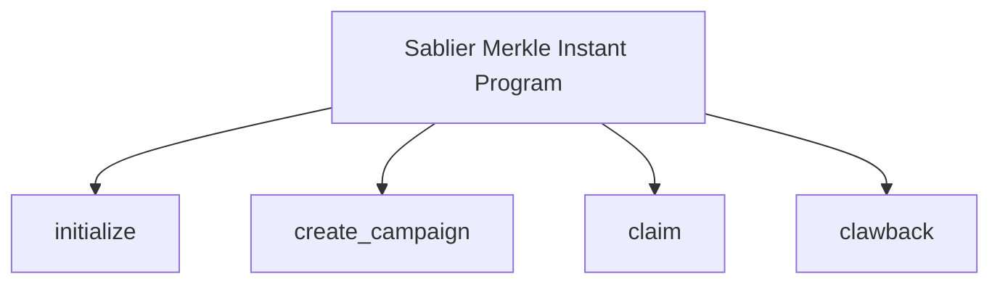
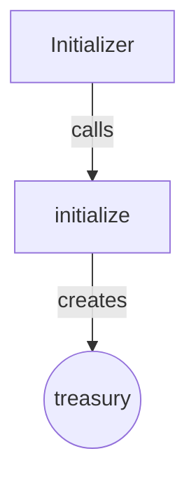
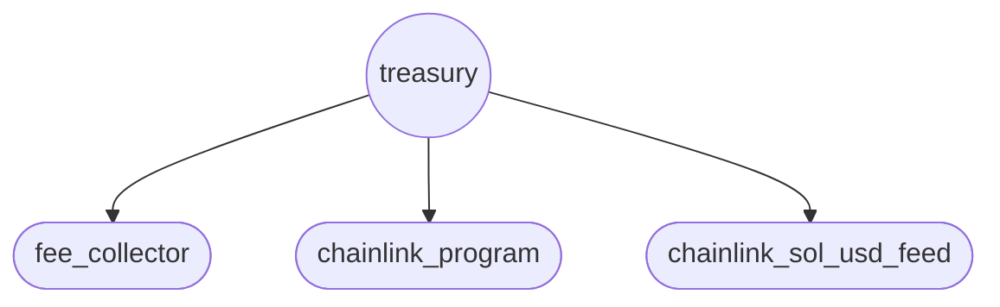
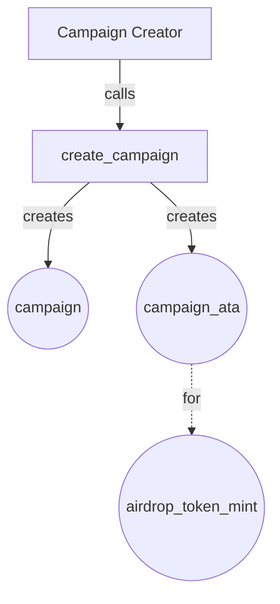
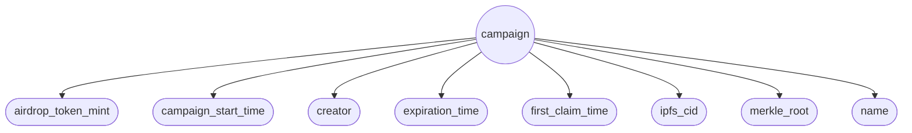
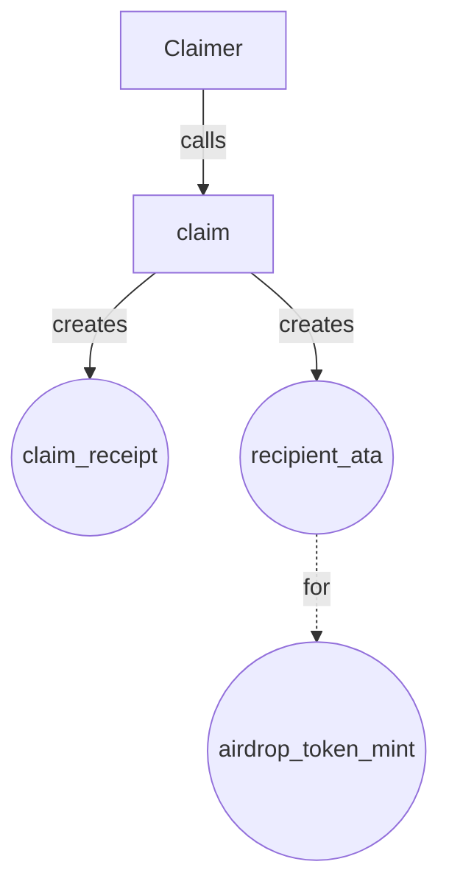
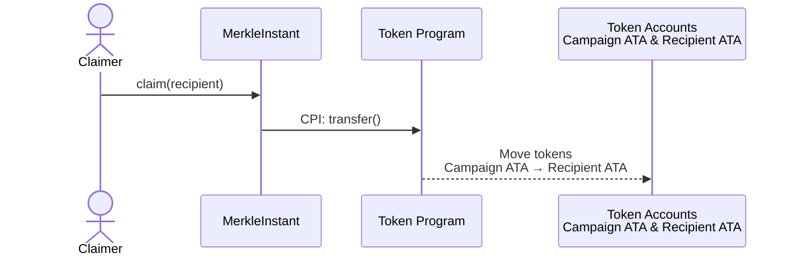
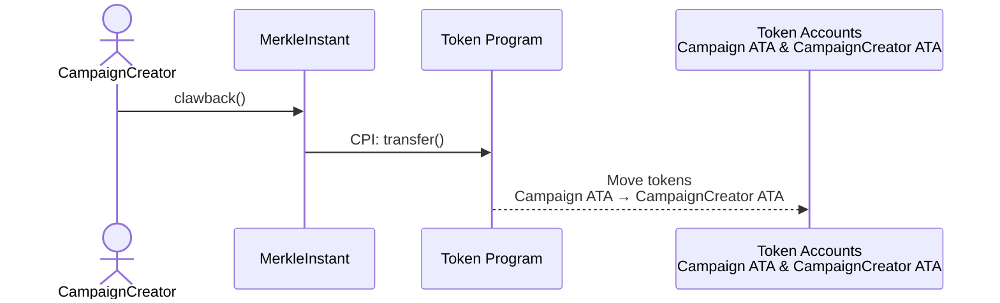

This section covers the program architecture, as well as the account structure and the token flow for the most important
instructions of the Merkle Instant program.

## Program Architecture

The `sablier_merkle_instant` program implements the following main functionalities:

- `initialize`
- `create_campaign`
- `claim`
- `clawback`

## Ix Account Architecture

The following sections detail the accounts created by each instruction.

### `initialize` Instruction

The
[Treasury PDA](https://github.com/sablier-labs/solsab/blob/e1085fe87ea3d02556156ee446e820d150af483e/programs/merkle_instant/src/state/treasury.rs#L5-L10)
stores this data:

### `create_campaign` Instruction

Each
[Campaign](https://github.com/sablier-labs/solsab/blob/e1085fe87ea3d02556156ee446e820d150af483e/programs/merkle_instant/src/state/campaign.rs#L8-L20)
account stores the following parameters:

### `claim` Instruction

The
[Claim receipt](https://github.com/sablier-labs/solsab/blob/e1085fe87ea3d02556156ee446e820d150af483e/programs/merkle_instant/src/state/claim_receipt.rs#L6)
account serves as proof of claim for the given recipient.

## Airdrop Token Flow

The airdrop token flow begins when the campaign creator funds the campaign's ATA. Once funded and the campaign has
started, eligible recipients can claim their tokens. The campaign creator can clawback any remaining tokens after the
campaign expires. The following diagrams illustrate how tokens move between accounts when each instruction is executed.

### `create_campaign` Instruction

This instruction creates the campaign account and its ATA, but does not perform the airdrop token transfer. The campaign
creator must fund the campaign ATA in a separate transaction after campaign creation. After that, the campaign ATA will
hold all tokens available for distribution to eligible recipients.

### `claim` Instruction

Eligible recipients can claim their airdrop tokens by providing a valid Merkle proof. When claimed, tokens are
transferred from the campaign ATA to the recipient's ATA.

### `clawback` Instruction

After the campaign expiration time, the campaign creator can clawback any remaining/unclaimed tokens. These tokens are
transferred from the campaign ATA back to the campaign creator's ATA.

